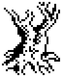
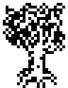
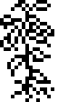
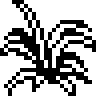
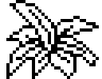
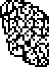
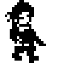

# Object sprites (part 1)

First animation frame of each object type used in part 1, drawn from the part1 snapshot at 4x scale. Black is ink, white is the sprite's own paper (inside the mask), and the rest is transparent.

| Type | Name | Used as | Sprite | Image |
|------|------|---------|--------|-------|
| 00 |  | scenery (C1) | 24x20 at EEB8 |  |
| 01 | cube | scenery (C1) | 24x20 at FD24 |  |
| 02 | bubble | item list | 24x21 at FB46 |  |
| 03 |  | scenery (C1) | 24x23 at EE2E |  |
| 04 |  | scenery (C1) | 24x23 at EDA4 |  |
| 05 |  | scenery (C1) | 32x24 at FC64 |  |
| 06 |  | scenery (C1) | 32x40 at F008 |  |
| 07 |  | scenery (C1) | 24x36 at EF30 |  |
| 08 | barrel | item list | 24x29 at 90F6 |  |
| 09 | bottle | item list | 16x16 at 91D4 |  |
| 0A |  | scenery (C1) | 24x31 at F148 |  |
| 0B | rock | item list | 16x14 at FC2C |  |
| 0C | rock | item list | 16x12 at FBFC |  |
| 0E | key | item list | 16x5 at 91C0 |  |
| 0F | rock | item list | 16x14 at FBC4 |  |
| 13 |  | scenery (C1) | 16x28 at F444 |  |
| 14 |  | scenery (C1) | 24x17 at F35A |  |
| 15 |  | scenery (C1) | 24x24 at F2CA |  |
| 16 |  | scenery (C1) | 32x25 at F202 |  |
| 17 |  | scenery (C1) | 16x33 at F3C0 |  |
| 18 |  | scenery (C1) | 24x34 at F4B4 |  |
| 1A |  | scenery (C1) | invisible | - |
| 1B |  | scenery (C1) | invisible | - |
| 1C |  | scenery (C1) | invisible | - |
| 1D |  | scenery (C1) | 40x23 at F6B8 |  |
| 1F | chicken | item list | 16x10 at 9214 |  |
| 20 |  | scenery (C1) | invisible | - |
| 21 | wolf | item list | 40x30 at E69C |  |
| 23 | guard | item list | 24x26 at F79E |  |
| 24 | guard | item list | 24x26 at F79E |  |
| 25 | guard | item list | 24x26 at F79E |  |
| 27 |  | scenery (C1) | 16x32 at F580 |  |
| 28 |  | scenery (C1) | 16x23 at F600 |  |
| 29 | magic wand | item list | 16x7 at 91A4 |  |
| 2A | magic potion | item list | 16x7 at 90DA |  |
| 2B | potion | item list | 16x10 at 908A |  |
| 31 | sword | item list | 16x7 at 906E |  |
| 33 | moving block | item list | 40x23 at F6B8 |  |
| 34 |  | scenery (C1) | 24x14 at 8FEC |  |
| 36 |  | doorway (D5 00) | invisible | - |
| 37 |  | doorway (D5 01) | 24x51 at FD9C |  |
| 38 |  | doorway (D5 02) | invisible | - |
| 39 |  | doorway (D5 03) | 24x51 at FECE |  |
| 3A |  | doorway (D5 04) | invisible | - |
| 3B |  | doorway (D5 05) | invisible | - |
| 3C |  | doorway (D5 06) | invisible | - |
| 3D |  | doorway (D5 07) | invisible | - |
| 3E |  | doorway (D5 08) | invisible | - |
