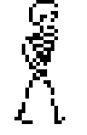
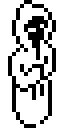
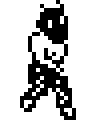
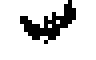
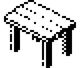
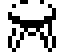
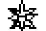
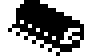
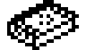
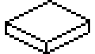

# Dynamic objects

There is a primary copy of the object data at BD00. At the start of the game,
this is copied to D5ED, which is the in-game copy of the data.

```
bd00: 05 25 c0 38 4a 9a ; guard
bd06: 40 0e 20 80 34 8d ; key
bd0c: 37 0e 20 92 56 a0 ; key
bd12: 21 0e 20 40 5c 62 ; key
bd18: 2d 0e 20 80 34 7a ; key
bd1e: 29 0e 20 62 34 74 ; key
bd24: fe 31 2a 00 00 00 ; used for objects carried across from part 1
bd2a: fe 03 00 00 00 00 ; used for objects carried across from part 1
bd30: fe 03 00 00 00 00 ; used for objects carried across from part 1
bd36: fe 03 00 00 00 00 ; used for objects carried across from part 1
bd3c: fe 03 00 00 00 00 ; used for objects carried across from part 1
bd42: 0f 25 c0 34 4a 9a ; guard
bd48: 0f 2e 2c 9c 66 88 ; spiky ball
bd4e: 0f 2f a0 59 38 46 ; disk
bd54: 10 10 80 60 50 46 ; monk
bd5a: 10 25 c0 36 4a 96 ; guard
bd60: 12 0d c0 6a 50 92 ; skeleton
bd66: 14 12 c0 56 4c 40 ; ogre
bd6c: 14 2c 00 60 40 5a ; table
bd72: 14 2d 20 5e 3a 72 ; stool
bd78: 14 2d 20 60 3a 4a ; stool
bd7e: 14 2d 20 56 3a 60 ; stool
bd84: 16 12 c0 70 4c 66 ; ogre
bd8a: 19 2f 80 7e 38 60 ; disk
bd90: 19 2f 80 a6 38 74 ; disk
bd96: 1a 2e 2c 7a 3c 36 ; spiky ball
bd9c: 1a 2e 2c 7a 3c 70 ; spiky ball
bda2: 1b 12 c0 6c 4c 64 ; ogre
bda8: 1f 2c 00 4a 40 66 ; table
bdae: 1f 2c 00 66 40 6a ; table
bdb4: 21 33 00 40 5a 5a ; moving block
bdba: 21 2c 00 54 40 56 ; table
bdc0: 21 10 80 6e 50 7c ; monk
bdc6: 24 2f a0 62 38 4e ; disk
bdcc: 24 2f a0 72 38 a0 ; disk
bdd2: 26 2f a0 9a 38 78 ; disk
bdd8: 26 2f a0 3c 38 50 ; disk
bdde: 28 12 c0 86 4c 70 ; ogre
bde4: 29 12 c0 72 4c 80 ; ogre
bdea: 2c 2e 2c 7e 3c 98 ; spiky ball
bdf0: 2c 2e 2c 7e 3c 7a ; spiky ball
bdf6: 2c 2e 2c 6a 3c 7a ; spiky ball
bdfc: 2c 2e 2c 66 3c 9a ; spiky ball
be02: 2f 10 80 5a 50 5a ; monk
be08: 33 33 00 46 46 32 ; moving block
be0e: 33 33 00 50 3e 32 ; moving block
be14: 33 33 00 5a 38 32 ; moving block
be1a: 36 10 80 6c 50 64 ; monk
be20: 37 12 c0 56 4c 78 ; ogre
be26: 38 12 c0 6e 4c 8e ; ogre
be2c: 3b 0d c0 6a 50 9a ; skeleton
be32: 3d 12 c0 56 4c 8c ; ogre
be38: 3e 2f a0 9a 38 78 ; disk
be3e: 3e 2f a0 9a 38 a0 ; disk
be44: 3f 09 24 64 4c 64 ; bottle
be4a: 3f 10 80 54 50 84 ; monk
be50: 3f 2b 26 62 80 60 ; potion
be56: 3f 2c 00 60 40 5a ; table
be5c: 3f 2d 20 62 3a 4e ; stool
be62: 3f 2d 20 56 3a 5e ; stool
be68: 40 2e 2c 7e 3c 98 ; spiky ball
be6e: 40 2e 2c 7e 3c 7a ; spiky ball
be74: 40 2e 2c 6a 3c 7a ; spiky ball
be7a: 40 2e 2c 66 3c 9a ; spiky ball
be80: 41 0d c0 6a 50 9a ; skeleton
be86: 42 2c 00 54 40 78 ; table
be8c: 42 09 00 5a 4a 7c ; bottle
be92: 44 33 00 66 2a 8c ; moving block
be98: 46 33 00 66 2a 8c ; moving block
be9e: 46 30 2d c8 3c 96 ; magic carpet
bea4: 49 10 80 54 50 84 ; monk
beaa: 4a 0d c0 6e 50 8e ; skeleton
beb0: 4b 0d c0 50 50 50 ; skeleton
beb6: 4d 2c 00 3c 40 46 ; table
bebc: 4d 2d 20 34 3a 4e ; stool
bec2: 4d 2d 20 3a 3a 32 ; stool
bec8: 4e 10 80 7c 4e 6a ; monk
bece: 4f 10 80 7c 68 8a ; monk
bed4: 50 10 80 92 6e 72 ; monk
beda: 51 32 20 8c 5a 8c ; book
bee0: 51 26 80 74 5a a0 ; bat
bee6: ff
```

Each entry is `<room> <type> <flags> <x> <y> <z>`. See [the general description](../dynamic_objects.md)
for what the fields mean.

## Object types in part 2

The attributes come from the object-type table at 7768 (see
[Object-type table](../dynamic_objects.md#object-type-table-7768-11-bytes-per-entry)), which is
the same in both parts.

| Type | Name | Image | Flags | Meaning of the flags | Sprite | Size (x, y, z) | Class | Byte 16 |
|------|------|-------|-------|----------------------|--------|----------------|-------|---------|
| 03 | (empty carried slot) | - | 00 | Placeholder, see the notes | 24x23 | 0A 0E 0A | 00 | 00 |
| 09 | bottle | [](sprites/type_09_bottle.png) | 24 | Portable; energy + 10 when used | 16x16 | 06 0C 06 | 00 | 10 (weight 0) |
| 09 | bottle (room 42) | [](sprites/type_09_bottle.png) | 00 | Fixed: this one cannot be picked up | 16x16 | 06 0C 06 | 00 | 10 |
| 0D | skeleton | [](sprites/type_0D_skeleton.png) | C0 | Creature: hurts, can be killed | 24x37 | 0E 1E 0E | 04 | 16 (mass) |
| 0E | key | [](sprites/type_0E_key.png) | 20 | Portable (opens doors) | 16x5 | 04 02 08 | 00 | 10 (weight 0) |
| 10 | monk | [](sprites/type_10_monk.png) | 80 | Creature: hurts, **cannot** be killed with the sword (a spiky ball can kill it) | 16x32 | 0A 1E 0A | 0E | 18 (mass) |
| 12 | ogre | [](sprites/type_12_ogre.png) | C0 | Creature: hurts, can be killed | 24x32 | 0A 1A 0A | 0B | 16 (mass) |
| 25 | guard | [](sprites/type_25_guard.png) | C0 | Creature: hurts, can be killed | 24x26 | 0A 18 0A | 09 | 14 (mass) |
| 26 | bat | [](sprites/type_26_bat.png) | 80 | Hurts, cannot be killed (it leaves the room too quickly for a spiky ball to reach it) | 24x15 | 08 08 08 | 0C | 10 |
| 2B | potion | [](sprites/type_2B_potion.png) | 26 | Portable; energy set to 99 when used | 16x10 | 06 08 06 | 00 | 10 (weight 0) |
| 2C | table | [](sprites/type_2C_table.png) | 00 | Fixed | 40x34 | 0E 0E 16 | 00 | 16 |
| 2D | stool | [](sprites/type_2D_stool.png) | 20 | Portable | 16x13 | 08 08 08 | 00 | 13 (weight 3) |
| 2E | spiky ball | [](sprites/type_2E_spiky_ball.png) | 2C | Portable; a weapon once used (moves along and kills the first creature it hits) | 24x16 | 0A 0A 0A | 00 | 10 (weight 0) |
| 2F | disk | [](sprites/type_2F_disk.png) | 80 or A0 | Hurts, cannot be killed (a spiky ball passes over it); A0 is also flagged portable | 24x9 | 0C 06 0C | 0D | 18 (weight 8, mass 18) |
| 30 | magic carpet | [](sprites/type_30_magic_carpet.png) | 2D | Portable; the player rides it when used | 24x14 | 0A 0A 12 | 00 | 14 (weight 4) |
| 32 | book | [](sprites/type_32_book.png) | 20 | Portable | 24x14 | 0E 04 0A | 00 | 10 (weight 0) |
| 33 | moving block | [](sprites/type_33_moving_block.png) | 00 | Fixed (cannot be picked up) | 40x23 | 10 06 10 | 01 | 18 |

## Notes

- **The five "room FE" entries (items 7-11)** are the slots for the objects the player carries
  over from part 1. When part 2 starts (template 8B, during the handover), each one is given the
  type of the matching carried object, and its flags are copied from that object's record. Type
  03 marks a slot that was empty. In the snapshot this listing comes from, item 7 has type 31
  and flags 2A: that is part 1's sword.
- **Keys and locks.** An object's id is its 1-based position in this list, and a door's lock
  stores the id of its key minus 1. The keys are items 2-6:

  | Key (item) | Lies in room | Opens the door in room | Lock value |
  |------------|--------------|------------------------|------------|
  | 2 | 40 | 47 (to room 48) | 1 |
  | 3 | 37 | 4A (to room 4B) | 2 |
  | 4 | 21 | 4E (to room 4D) | 3 |
  | 5 | 2D | 4F (to room 50) | 4 |
  | 6 | 29 | (none) | - |

  The door from room 50 to room 51 is locked with variable 3C, which part 2 sets to the id of the
  magic wand minus 1 if the player carried it over from part 1. Without the wand, the game cannot
  be completed. After the player dies and part 2 restarts, the carried objects get their part 1
  ids back (a bug), so the wand no longer opens that door.
- **Enemies.** All of them do the same damage per tick and need the same number of hits. They
  differ in mass, which decides who shoves whom (the player has mass 12):

  | Enemy | Mass | Your bump shoves it | Its bump shoves you | Can be killed? |
  |-------|------|---------------------|---------------------|----------------|
  | Guard | 14 | 4 ticks | 8 ticks | yes |
  | Skeleton, ogre | 16 | 2 ticks | 10 ticks | yes |
  | Monk | 18 | cannot be shoved | 12 ticks | not with the sword, only with a spiky ball |
  | Disk | 18 | cannot be shoved | 12 ticks | no (a spiky ball passes over it) |

  The skeleton also has the largest bounding box (0E wide). The disk's class (0D) makes it move
  in random directions rather than chase the player.
- **The disk with flags A0** is flagged as portable, but it weighs 8, which is the carry limit,
  so trying to pick it up should always give "TOO HEAVY".
- **The spiky ball (kind C) is a weapon.** Using it arms it. When it is then dropped, it moves (hovering) in
  the direction the player is moving, and the player can steer it. It destroys the first creature
  it hits, including monks, which cannot be killed with the sword. In practice it cannot kill the
  disks, because it passes over them (they are only 06 high), or the bats, which leave the room
  too quickly. The ball is used
  up by the kill. It also kills the player if it hits them. See
  [Weapons (kind C)](../dynamic_objects.md#weapons-kind-c).
- **The magic carpet** has 10 uses (7B7A is set to 10 by template 83). See
  [Magic potion and magic carpet](../dynamic_objects.md#magic-potion-and-magic-carpet).