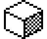
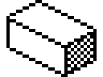
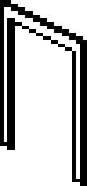

# Object sprites (part 2)

First animation frame of each object type used in part 2, drawn from the part2 snapshot at 4x scale. Black is ink, white is the sprite's own paper (inside the mask), and the rest is transparent.

| Type | Name | Used as | Sprite | Image |
|------|------|---------|--------|-------|
| 01 | cube | scenery (C1) | 24x20 at FD24 |  |
| 03 | (empty carried slot) | item list, location FE only | none in part 2 | - |
| 05 |  | scenery (C1) | 32x24 at FC64 |  |
| 09 | bottle | item list | 16x16 at 91D4 |  |
| 0D | skeleton | item list | 24x37 at EFA0 |  |
| 0E | key | item list | 16x5 at 91C0 |  |
| 10 | monk | item list | 16x32 at EEA0 |  |
| 12 | ogre | item list | 24x32 at E5F6 |  |
| 1A |  | scenery (C1) | invisible | - |
| 1B |  | scenery (C1) | invisible | - |
| 1C |  | scenery (C1) | invisible | - |
| 1D |  | scenery (C1) | 40x23 at F6B8 |  |
| 20 |  | scenery (C1) | invisible | - |
| 25 | guard | item list | 24x26 at F79E |  |
| 26 | bat | item list | 24x15 at EA76 |  |
| 2B | potion | item list | 16x10 at 908A |  |
| 2C | table | item list | 40x34 at F508 |  |
| 2D | stool | item list | 16x13 at F4D4 |  |
| 2E | spiky ball | item list | 24x16 at EDE0 |  |
| 2F | disk | item list | 24x9 at E58A |  |
| 30 | magic carpet | item list | 24x14 at E4E0 |  |
| 31 | sword | item list | 16x7 at 906E |  |
| 32 | book | item list | 24x14 at E536 |  |
| 33 | moving block | item list | 40x23 at F6B8 |  |
| 36 |  | doorway (D5 00) | invisible | - |
| 37 |  | doorway (D5 01) | 24x51 at FD9C |  |
| 38 |  | doorway (D5 02) | invisible | - |
| 39 |  | doorway (D5 03) | 24x51 at FECE |  |

Type 03 appears in part 2 only as the placeholder for an empty carried-object slot, which is never
drawn. Its type-table entry (24x23 at EE2E) is only valid in part 1. In part 2 that memory holds
the spiky ball's animation frames (24x16, from EDE0), so there is no type 03 image here. See part
1's sprites for its real graphic.

