# Templates in part 2

The rooms in part 2 are between positions 0x05 and 0x51 (although this range also includes templates which are not rooms).

Room 0x23 is unused.

## TEMPLATE 00 (not run by the game: the names of the script variables, from var20 upwards)
```
c200: ec 03 41 1f ; name of var20: "A"
c204: ec 03 42 1f ; name of var21: "B"
c208: ec 03 43 1f ; name of var22: "C"
c20c: ec 03 44 1f ; name of var23: "D"
c210: ec 06 4c 49 46 45 1f ; name of var24: "LIFE"
c217: ec 03 58 1f ; name of var25: "X"
c21b: ec 03 59 1f ; name of var26: "Y"
c21f: ec 03 5a 1f ; name of var27: "Z"
c223: ec 04 4e 30 1f ; name of var28: "N0"
c228: ec 04 4e 31 1f ; name of var29: "N1"
c22d: ec 04 4e 32 1f ; name of var2A: "N2"
c232: ec 04 4e 33 1f ; name of var2B: "N3"
c237: ec 04 4e 34 1f ; name of var2C: "N4"
c23c: ec 04 4e 35 1f ; name of var2D: "N5"
c241: ec 03 45 1f ; name of var2E: "E"
c245: ec 03 46 1f ; name of var2F: "F"
c249: ec 04 58 31 1f ; name of var30: "X1"
c24e: ec 04 59 31 1f ; name of var31: "Y1"
c253: ec 04 5a 31 1f ; name of var32: "Z1"
c258: ec 04 41 31 1f ; name of var33: "A1"
c25d: ec 06 52 4f 4f 4d 1f ; name of var34: "ROOM"
c264: ec 05 4e 31 35 1f ; name of var35: "N15"
c26a: ec 04 4e 36 1f ; name of var36: "N6"
c26f: ec 04 4e 37 1f ; name of var37: "N7"
c274: ec 04 4e 38 1f ; name of var38: "N8"
c279: ec 04 4e 39 1f ; name of var39: "N9"
c27e: ec 05 4e 31 33 1f ; name of var3A: "N13"
c284: ec 04 41 41 1f ; name of var3B: "AA"
c289: ec 05 4b 45 59 1f ; name of var3C: "KEY"
```

## TEMPLATE 01
[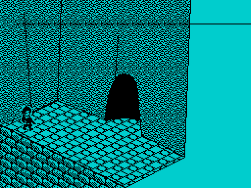
```
c28f: ee 06 3b fe e7 03 1f ; evaluate expression
c296: ee 05 21 ff 05 1f ; evaluate expression
c29c: ee 04 34 21 1f ; evaluate expression
c2a1: ee 04 20 21 1f ; evaluate expression
c2a6: d6 ff 75 ; include template
c2a9: d6 ff 83 ; include template
```

## TEMPLATE 02
[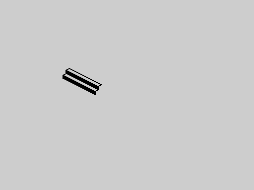]
```
c2ac: c4 ; line start = pen
c2ad: e1 29 ; flag 10: relative coords
c2af: 01 01 ; pen to (y, x)
c2b1: d6 ff 53 ; include template
c2b4: b9 27 ; pen to (y, x)
c2b6: d6 ff 53 ; include template
```

## TEMPLATE 03
[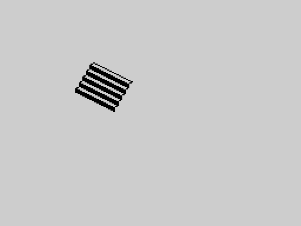]
```
c2b9: c4 ; line start = pen
c2ba: e1 29 ; flag 10: relative coords
c2bc: 01 01 ; pen to (y, x)
c2be: d6 2a ; include template
c2c0: b8 26 ; pen to (y, x)
c2c2: d6 2a ; include template
c2c4: b9 27 ; pen to (y, x)
c2c6: d6 ff 53 ; include template
```

## TEMPLATE 04
[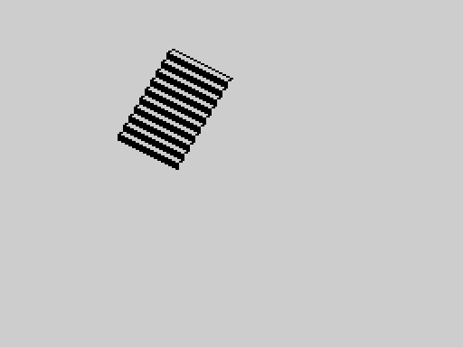]
```
c2c9: c4 ; line start = pen
c2ca: e1 29 ; flag 10: relative coords
c2cc: 01 01 ; pen to (y, x)
c2ce: d6 2b ; include template
c2d0: b7 25 ; pen to (y, x)
c2d2: d6 2b ; include template
```

## TEMPLATE 05
[]
```
c2d4: d0 28 ; set attribute
c2d6: d1 24 ; set drawing flags (C024)
c2d8: da 00 80 ; move line start
c2db: 40 00 ; pen to (y, x)
c2dd: 4d 20 ; pen to (y, x)
c2df: 59 39 ; pen to (y, x)
c2e1: 4e 56 ; pen to (y, x)
c2e3: 45 6a ; pen to (y, x)
c2e5: 62 6f ; pen to (y, x)
c2e7: 71 76 ; pen to (y, x)
c2e9: 74 7d ; pen to (y, x)
c2eb: 72 85 ; pen to (y, x)
c2ed: 6b 8b ; pen to (y, x)
c2ef: 35 90 ; pen to (y, x)
c2f1: 1f bc ; pen to (y, x)
c2f3: 00 80 ; pen to (y, x)
c2f5: da 45 6b ; move line start
c2f8: 47 7f ; pen to (y, x)
c2fa: 45 8f ; pen to (y, x)
c2fc: da 4d 20 ; move line start
c2ff: b3 18 ; pen to (y, x)
c301: da 59 3a ; move line start
c304: bf 3e ; pen to (y, x)
c306: da 70 75 ; move line start
c309: 9b 78 ; pen to (y, x)
c30b: da 20 bc ; move line start
c30e: bf c2 ; pen to (y, x)
c310: d1 00 ; set drawing flags (C024)
c312: 14 80 ; pen to (y, x)
c314: dc 3a ; textured flood fill
c316: 0a 0a ; pen to (y, x)
c318: dc 35 ; textured flood fill
c31a: 49 80 ; pen to (y, x)
c31c: dc 2b ; textured flood fill
c31e: 9d 96 ; pen to (y, x)
c320: dc 29 ; textured flood fill
c322: b4 1e ; pen to (y, x)
c324: dc 29 ; textured flood fill
c326: c2 10 ; set room bounding box (preset)
c328: d5 00 6a 5c 64 ; place doorway (type, x, y, z)
c32d: e7 01 0f 36 5c 64 ; room exit
```

## TEMPLATE 06
[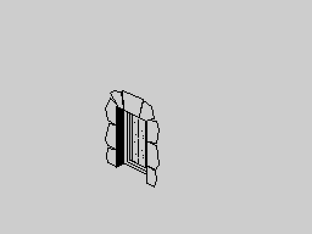]
```
c333: d6 ff 73 ; include template
c336: da 00 01 ; move line start
c339: 95 01 ; pen to (y, x)
c33b: bd fa ; pen to (y, x)
c33d: 32 00 ; pen to (y, x)
c33f: b4 19 ; pen to (y, x)
c341: 8d 00 ; pen to (y, x)
c343: da 10 ee ; move line start
c346: 07 00 ; pen to (y, x)
c348: 03 00 ; pen to (y, x)
c34a: 08 f0 ; pen to (y, x)
c34c: 28 00 ; pen to (y, x)
c34e: 00 02 ; pen to (y, x)
c350: 99 00 ; pen to (y, x)
c352: b9 0e ; pen to (y, x)
c354: da b4 00 ; move line start
c357: b1 06 ; pen to (y, x)
c359: 06 02 ; pen to (y, x)
c35b: 07 ff ; pen to (y, x)
c35d: 04 fa ; pen to (y, x)
c35f: bd 06 ; pen to (y, x)
c361: 04 03 ; pen to (y, x)
c363: 10 fe ; pen to (y, x)
c365: 03 f9 ; pen to (y, x)
c367: bf 07 ; pen to (y, x)
c369: 0b 02 ; pen to (y, x)
c36b: 07 fe ; pen to (y, x)
c36d: 01 f9 ; pen to (y, x)
c36f: 01 05 ; pen to (y, x)
c371: 0a fe ; pen to (y, x)
c373: 05 f9 ; pen to (y, x)
c375: b3 fd ; pen to (y, x)
c377: 0e 03 ; pen to (y, x)
c379: 07 ef ; pen to (y, x)
c37b: b1 01 ; pen to (y, x)
c37d: 0e fe ; pen to (y, x)
c37f: 01 fa ; pen to (y, x)
c381: be fd ; pen to (y, x)
c383: b6 06 ; pen to (y, x)
c385: 06 fa ; pen to (y, x)
c387: b8 fc ; pen to (y, x)
c389: b6 02 ; pen to (y, x)
c38b: bc 06 ; pen to (y, x)
c38d: 01 fb ; pen to (y, x)
c38f: b3 fd ; pen to (y, x)
c391: bb 02 ; pen to (y, x)
c393: bd 06 ; pen to (y, x)
c395: 01 fa ; pen to (y, x)
c397: b9 ff ; pen to (y, x)
c399: bb 01 ; pen to (y, x)
c39b: bd 06 ; pen to (y, x)
c39d: e2 28 ; flag 04: chain lines
c39f: e4 28 ; flag 20: pen down
c3a1: 0d 11 ; pen to (y, x)
c3a3: dc ff 0e ; textured flood fill
c3a6: 0b f3 ; pen to (y, x)
c3a8: dc 2b ; textured flood fill
```

## TEMPLATE 07
[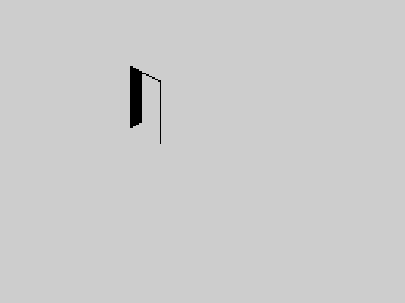]
```
c3aa: d6 ff 73 ; include template
c3ad: da 01 01 ; move line start
c3b0: 28 01 ; pen to (y, x)
c3b2: 09 ed ; pen to (y, x)
c3b4: 9a 00 ; pen to (y, x)
c3b6: 03 07 ; pen to (y, x)
c3b8: 1f 00 ; pen to (y, x)
c3ba: e4 28 ; flag 20: pen down
c3bc: e2 28 ; flag 04: chain lines
c3be: 01 fa ; pen to (y, x)
c3c0: dc 2b ; textured flood fill
c3c2: e1 28 ; flag 10: relative coords
```

## TEMPLATE 08
[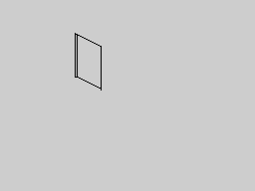]
```
c3c4: d6 ff 73 ; include template
c3c7: da 01 01 ; move line start
c3ca: 2d 01 ; pen to (y, x)
c3cc: 0d e6 ; pen to (y, x)
c3ce: 94 00 ; pen to (y, x)
c3d0: 01 02 ; pen to (y, x)
c3d2: 2a 00 ; pen to (y, x)
c3d4: 95 00 ; pen to (y, x)
c3d6: b5 17 ; pen to (y, x)
c3d8: e1 28 ; flag 10: relative coords
c3da: e2 28 ; flag 04: chain lines
c3dc: e4 28 ; flag 20: pen down
```

## TEMPLATE 09
[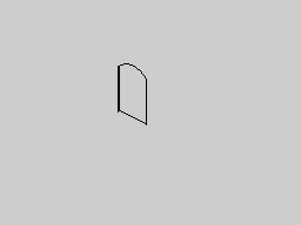]
```
c3de: d6 ff 73 ; include template
c3e1: da 23 00 ; move line start
c3e4: 25 06 ; pen to (y, x)
c3e6: bf 06 ; pen to (y, x)
c3e8: bb 07 ; pen to (y, x)
c3ea: b9 05 ; pen to (y, x)
c3ec: 99 00 ; pen to (y, x)
c3ee: da 31 e8 ; move line start
c3f1: 0b e8 ; pen to (y, x)
c3f3: 01 01 ; pen to (y, x)
c3f5: 26 00 ; pen to (y, x)
c3f7: 9a 00 ; pen to (y, x)
c3f9: b5 17 ; pen to (y, x)
c3fb: e2 28 ; flag 04: chain lines
c3fd: e4 28 ; flag 20: pen down
```

## TEMPLATE 0a
[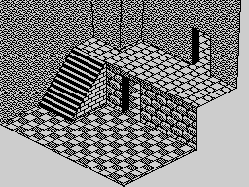]
```
c3ff: d5 00 7a 5c 6c ; place doorway (type, x, y, z)
c404: d5 00 a4 86 4e ; place doorway (type, x, y, z)
c409: 45 4b ; pen to (y, x)
c40b: d7 2c ; include template (save/restore state)
c40d: 79 6b ; pen to (y, x)
c40f: d7 2a ; include template (save/restore state)
c411: 41 8f ; pen to (y, x)
c413: d7 37 ; include template (save/restore state)
c415: 72 d7 ; pen to (y, x)
c417: d7 37 ; include template (save/restore state)
c419: d1 24 ; set drawing flags (C024)
c41b: da 00 80 ; move line start
c41e: 40 00 ; pen to (y, x)
c420: 53 27 ; pen to (y, x)
c422: da 43 49 ; move line start
c425: 55 6d ; pen to (y, x)
c427: 7f 6d ; pen to (y, x)
c429: 51 ca ; pen to (y, x)
c42b: 26 ca ; pen to (y, x)
c42d: 00 7e ; pen to (y, x)
c42f: da 7e 6d ; move line start
c432: 4f ca ; pen to (y, x)
c434: da 54 6d ; move line start
c437: 4c 7c ; pen to (y, x)
c439: da 42 90 ; move line start
c43c: 25 ca ; pen to (y, x)
c43e: da 51 ca ; move line start
c441: 65 f3 ; pen to (y, x)
c443: 72 d8 ; pen to (y, x)
c445: da 7d c5 ; move line start
c448: 97 91 ; pen to (y, x)
c44a: 8c 7b ; pen to (y, x)
c44c: 99 60 ; pen to (y, x)
c44e: bd 5e ; pen to (y, x)
c450: da 9a 60 ; move line start
c453: 90 4e ; pen to (y, x)
c455: da bd 93 ; move line start
c458: 99 91 ; pen to (y, x)
c45a: da 90 7b ; move line start
c45d: bf 7c ; pen to (y, x)
c45f: da 65 f3 ; move line start
c462: bf f7 ; pen to (y, x)
c464: d1 00 ; set drawing flags (C024)
c466: be c8 ; pen to (y, x)
c468: dc 29 ; textured flood fill
c46a: be 46 ; pen to (y, x)
c46c: dc 29 ; textured flood fill
c46e: 78 96 ; pen to (y, x)
c470: dc 3a ; textured flood fill
c472: 73 6e ; pen to (y, x)
c474: dc 35 ; textured flood fill
c476: 64 69 ; pen to (y, x)
c478: dc 37 ; textured flood fill
c47a: 1e 80 ; pen to (y, x)
c47c: dc 2c ; textured flood fill
c47e: c2 01 ; set room bounding box (preset)
c480: c1 20 00 7e 5c 32 ; place object (type, flags, x, y, z)
c486: c1 20 00 98 5c 32 ; place object (type, flags, x, y, z)
c48c: c1 20 00 a6 86 32 ; place object (type, flags, x, y, z)
c492: c1 20 00 8e 86 92 ; place object (type, flags, x, y, z)
c498: c3 56 34 90 ; set object position
c49c: ee 05 23 ff 56 1f ; evaluate expression
c4a2: ee 05 2e ff 34 1f ; evaluate expression
c4a8: ee 05 2f ff 0b 1f ; evaluate expression
c4ae: d6 ff 54 ; include template
```

## TEMPLATE 0b
[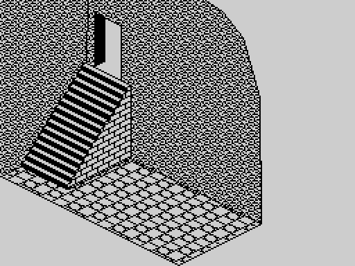]
```
c4b1: d5 00 6c 90 9a ; place doorway (type, x, y, z)
c4b6: 39 32 ; pen to (y, x)
c4b8: d7 2c ; include template (save/restore state)
c4ba: 6c 52 ; pen to (y, x)
c4bc: d7 2b ; include template (save/restore state)
c4be: 85 56 ; pen to (y, x)
c4c0: d6 37 ; include template
c4c2: d1 24 ; set drawing flags (C024)
c4c4: da 47 0f ; move line start
c4c7: 40 00 ; pen to (y, x)
c4c9: 00 80 ; pen to (y, x)
c4cb: 1e bc ; pen to (y, x)
c4cd: 79 bb ; pen to (y, x)
c4cf: a4 af ; pen to (y, x)
c4d1: b7 a0 ; pen to (y, x)
c4d3: bf 94 ; pen to (y, x)
c4d5: da 37 31 ; move line start
c4d8: 4d 5d ; pen to (y, x)
c4da: 1e bc ; pen to (y, x)
c4dc: da 4e 5e ; move line start
c4df: 81 5e ; pen to (y, x)
c4e1: da 93 3e ; move line start
c4e4: bf 3f ; pen to (y, x)
c4e6: d1 00 ; set drawing flags (C024)
c4e8: bf 50 ; pen to (y, x)
c4ea: dc 29 ; textured flood fill
c4ec: 64 0a ; pen to (y, x)
c4ee: dc 29 ; textured flood fill
c4f0: 32 80 ; pen to (y, x)
c4f2: dc 3a ; textured flood fill
c4f4: 63 55 ; pen to (y, x)
c4f6: dc 37 ; textured flood fill
c4f8: c2 10 ; set room bounding box (preset)
c4fa: c3 3c 36 90 ; set object position
c4fe: ee 05 23 ff 3c 1f ; evaluate expression
c504: ee 05 2e ff 36 1f ; evaluate expression
c50a: ee 05 2f ff 0d 1f ; evaluate expression
c510: d6 ff 54 ; include template
```

## TEMPLATE 0c
[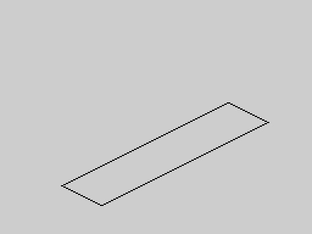]
```
c513: e2 29 ; flag 04: chain lines
c515: e4 29 ; flag 20: pen down
c517: da 17 53 ; move line start
c51a: 27 32 ; pen to (y, x)
c51c: 6b bb ; pen to (y, x)
c51e: 5b dc ; pen to (y, x)
c520: 17 53 ; pen to (y, x)
c522: e2 28 ; flag 04: chain lines
c524: e4 28 ; flag 20: pen down
c526: c2 13 ; set room bounding box (preset)
```

## TEMPLATE 0d
[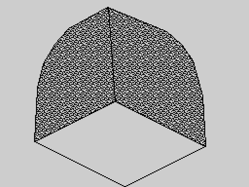]
```
c528: e2 29 ; flag 04: chain lines
c52a: e4 29 ; flag 20: pen down
c52c: da 00 80 ; move line start
c52f: 2e 23 ; pen to (y, x)
c531: 57 76 ; pen to (y, x)
c533: 29 d3 ; pen to (y, x)
c535: 00 81 ; pen to (y, x)
c537: da 57 76 ; move line start
c53a: b8 6f ; pen to (y, x)
c53c: da 2e 23 ; move line start
c53f: 65 26 ; pen to (y, x)
c541: 7e 2c ; pen to (y, x)
c543: 92 38 ; pen to (y, x)
c545: a2 46 ; pen to (y, x)
c547: b8 6e ; pen to (y, x)
c549: 9f ab ; pen to (y, x)
c54b: 91 bb ; pen to (y, x)
c54d: 81 c6 ; pen to (y, x)
c54f: 5d d0 ; pen to (y, x)
c551: 2a d3 ; pen to (y, x)
c553: e2 28 ; flag 04: chain lines
c555: e4 28 ; flag 20: pen down
c557: aa 78 ; pen to (y, x)
c559: dc 29 ; textured flood fill
c55b: aa 6e ; pen to (y, x)
c55d: dc 29 ; textured flood fill
c55f: c2 12 ; set room bounding box (preset)
```

## TEMPLATE 0e
[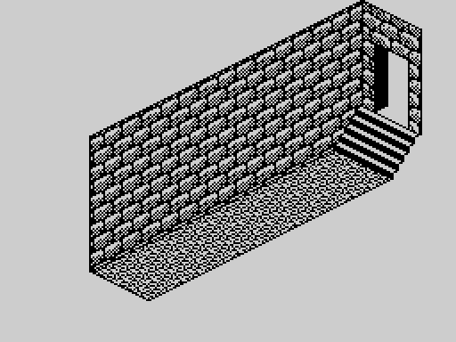]
```
c561: d6 ff 0c ; include template
c564: 76 e4 ; pen to (y, x)
c566: d6 37 ; include template
c568: 5e df ; pen to (y, x)
c56a: d7 2b ; include template (save/restore state)
c56c: d1 24 ; set drawing flags (C024)
c56e: da 28 32 ; move line start
c571: 73 32 ; pen to (y, x)
c573: bf cb ; pen to (y, x)
c575: af ec ; pen to (y, x)
c577: 74 ec ; pen to (y, x)
c579: da 85 cb ; move line start
c57c: be cb ; pen to (y, x)
c57e: d1 00 ; set drawing flags (C024)
c580: 64 80 ; pen to (y, x)
c582: dc ff 10 ; textured flood fill
c585: a9 dd ; pen to (y, x)
c587: dc 35 ; textured flood fill
c589: 2e 80 ; pen to (y, x)
c58b: dc 29 ; textured flood fill
c58d: d5 00 cc 6a 66 ; place doorway (type, x, y, z)
c592: c3 bc 34 5e ; set object position
c596: ee 05 23 ff bc 1f ; evaluate expression
c59c: ee 05 2e ff 34 1f ; evaluate expression
c5a2: ee 04 2f 2c 1f ; evaluate expression
c5a7: d6 ff 54 ; include template
```

## TEMPLATE 0f
[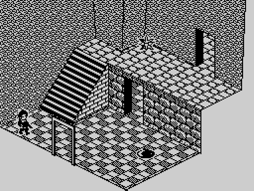]
```
c5aa: d6 ff 0a ; include template
c5ad: d5 01 30 5c 64 ; place doorway (type, x, y, z)
c5b2: e7 01 24 60 5c 64 ; room exit
c5b8: e7 02 11 34 5c 64 ; room exit
c5be: e7 03 05 66 5c 64 ; room exit
```

## TEMPLATE 10
[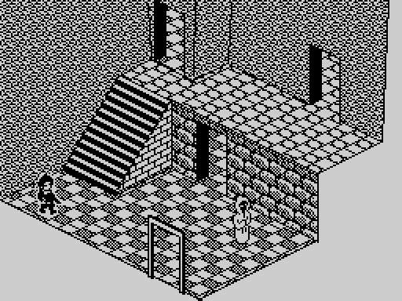]
```
c5c4: 8e 74 ; pen to (y, x)
c5c6: d6 37 ; include template
c5c8: d6 ff 0a ; include template
c5cb: be 78 ; pen to (y, x)
c5cd: dc 29 ; textured flood fill
c5cf: b4 73 ; pen to (y, x)
c5d1: dc 2c ; textured flood fill
c5d3: d5 00 8c 86 9a ; place doorway (type, x, y, z)
c5d8: d5 01 30 5c 3a ; place doorway (type, x, y, z)
c5dd: e7 01 2f 36 5c 64 ; room exit
c5e3: e7 02 34 48 5c 7e ; room exit
c5e9: e7 03 31 4a 5c 6c ; room exit
c5ef: e7 04 11 68 90 9a ; room exit
```

## TEMPLATE 11
[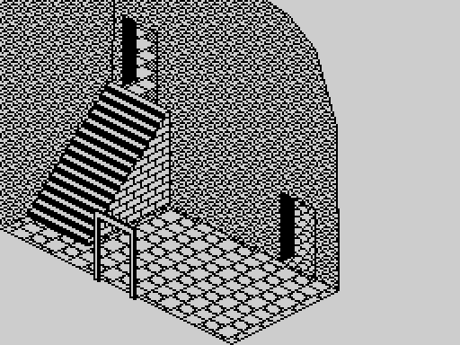]
```
c5f5: 23 ae ; pen to (y, x)
c5f7: d6 37 ; include template
c5f9: d6 ff 0b ; include template
c5fc: 8e 47 ; pen to (y, x)
c5fe: dc 2c ; textured flood fill
c600: 28 ad ; pen to (y, x)
c602: dc 39 ; textured flood fill
c604: e7 01 10 36 5c 36 ; room exit
c60a: d5 00 6c 5c 40 ; place doorway (type, x, y, z)
c60f: e7 02 12 60 5c 64 ; room exit
c615: d5 01 30 5c 64 ; place doorway (type, x, y, z)
c61a: e7 03 0f a0 86 4e ; room exit
```

## TEMPLATE 12
[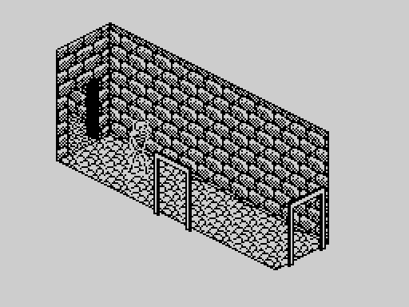]
```
c620: d6 ff 13 ; include template
c623: 5c 2c ; pen to (y, x)
c625: d7 ff 15 ; include template (save/restore state)
c628: d1 00 ; set drawing flags (C024)
c62a: 73 32 ; pen to (y, x)
c62c: dc 29 ; textured flood fill
c62e: 59 64 ; pen to (y, x)
c630: dc 39 ; textured flood fill
c632: d5 01 5c 5c 64 ; place doorway (type, x, y, z)
c637: e7 01 16 64 5c 36 ; room exit
c63d: e7 02 11 68 5c 40 ; room exit
c643: d5 03 64 5c 30 ; place doorway (type, x, y, z)
c648: e7 03 14 4e 5c 88 ; room exit
```

## TEMPLATE 13
[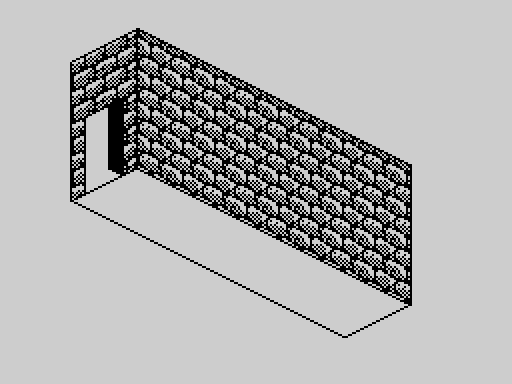]
```
c64e: 5d 2b ; pen to (y, x)
c650: e5 29 ; flag 40: mirror x
c652: d6 37 ; include template
c654: d1 24 ; set drawing flags (C024)
c656: da 5b 23 ; move line start
c659: a0 23 ; pen to (y, x)
c65b: b1 44 ; pen to (y, x)
c65d: 6d cd ; pen to (y, x)
c65f: 28 cd ; pen to (y, x)
c661: da b1 44 ; move line start
c664: 6c 44 ; pen to (y, x)
c666: d1 40 ; set drawing flags (C024)
c668: d7 fe 0c 00 ; include template (save/restore state)
c66c: d1 00 ; set drawing flags (C024)
c66e: 64 78 ; pen to (y, x)
c670: dc 35 ; textured flood fill
c672: 96 31 ; pen to (y, x)
c674: dc ff 10 ; textured flood fill
c677: c2 11 ; set room bounding box (preset)
c679: d5 02 64 5c b8 ; place doorway (type, x, y, z)
```

## TEMPLATE 14
[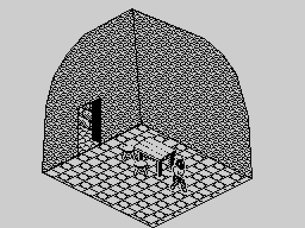]
```
c67e: 3b 43 ; pen to (y, x)
c680: d7 ff 15 ; include template (save/restore state)
c683: d6 3a ; include template
c685: 40 46 ; pen to (y, x)
c687: dc 39 ; textured flood fill
c689: 3c 64 ; pen to (y, x)
c68b: dc 3a ; textured flood fill
c68d: d5 02 4e 5c 8c ; place doorway (type, x, y, z)
c692: e7 01 12 64 5c 34 ; room exit
```

## TEMPLATE 15
[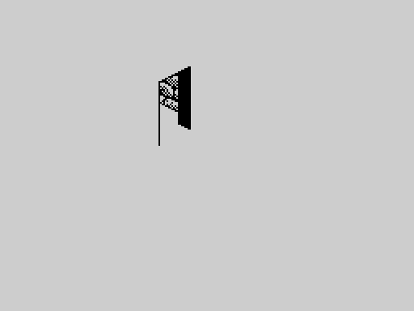]
```
c698: c4 ; line start = pen
c699: d1 50 ; set drawing flags (C024)
c69b: 01 01 ; pen to (y, x)
c69d: d7 37 ; include template (save/restore state)
c69f: d1 70 ; set drawing flags (C024)
c6a1: da 17 f7 ; move line start
c6a4: 1b 00 ; pen to (y, x)
c6a6: e4 28 ; flag 20: pen down
c6a8: 0b 00 ; pen to (y, x)
c6aa: dc 35 ; textured flood fill
c6ac: d1 00 ; set drawing flags (C024)
```

## TEMPLATE 16
[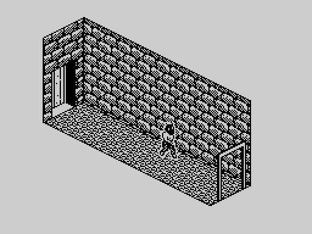]
```
c6ae: d6 ff 13 ; include template
c6b1: d1 00 ; set drawing flags (C024)
c6b3: 5d 2b ; pen to (y, x)
c6b5: d7 ff 18 ; include template (save/restore state)
c6b8: 2b c0 ; pen to (y, x)
c6ba: dc 29 ; textured flood fill
c6bc: e7 01 17 46 5c 34 ; room exit
c6c2: d5 03 64 5c 32 ; place doorway (type, x, y, z)
c6c7: e7 02 12 64 5c b4 ; room exit
```

## TEMPLATE 17
[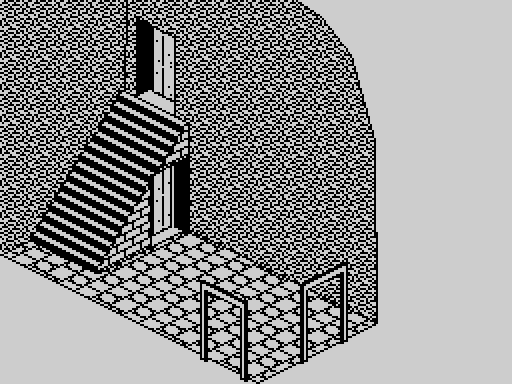]
```
c6cd: 40 4c ; pen to (y, x)
c6cf: d7 ff 18 ; include template (save/restore state)
c6d2: d6 ff 0b ; include template
c6d5: d1 20 ; set drawing flags (C024)
c6d7: da 8d 56 ; move line start
c6da: 92 4c ; pen to (y, x)
c6dc: e4 28 ; flag 20: pen down
c6de: 96 4e ; pen to (y, x)
c6e0: dc ff 0e ; textured flood fill
c6e3: 71 59 ; pen to (y, x)
c6e5: dc 37 ; textured flood fill
c6e7: 5a 4a ; pen to (y, x)
c6e9: dc 37 ; textured flood fill
c6eb: e7 01 19 36 5c 64 ; room exit
c6f1: d5 01 30 5c 34 ; place doorway (type, x, y, z)
c6f6: d5 03 46 5c 30 ; place doorway (type, x, y, z)
c6fb: e7 02 1b c8 70 5e ; room exit
c701: e7 03 16 64 5c b4 ; room exit
c707: d5 02 58 54 8c ; place doorway (type, x, y, z)
c70c: e7 04 1c 64 54 36 ; room exit
```

## TEMPLATE 18
[]
```
c712: c4 ; line start = pen
c713: d1 50 ; set drawing flags (C024)
c715: d7 37 ; include template (save/restore state)
c717: d1 74 ; set drawing flags (C024)
c719: da 2c f7 ; move line start
c71c: 0e f7 ; pen to (y, x)
c71e: bc 09 ; pen to (y, x)
c720: e4 28 ; flag 20: pen down
c722: 03 ff ; pen to (y, x)
c724: dc ff 0e ; textured flood fill
c727: e5 28 ; flag 40: mirror x
```

## TEMPLATE 19
[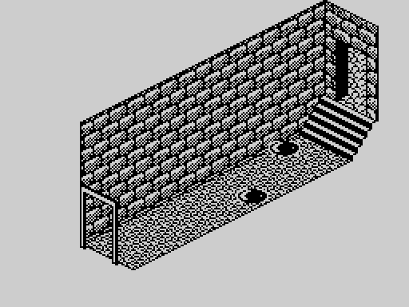]
```
c729: d6 ff 0e ; include template
c72c: d1 00 ; set drawing flags (C024)
c72e: 96 e4 ; pen to (y, x)
c730: dc 39 ; textured flood fill
c732: d5 01 30 5c 66 ; place doorway (type, x, y, z)
c737: e7 01 1a 36 5c 36 ; room exit
c73d: e7 02 17 6c 90 9a ; room exit
```

## TEMPLATE 1a
[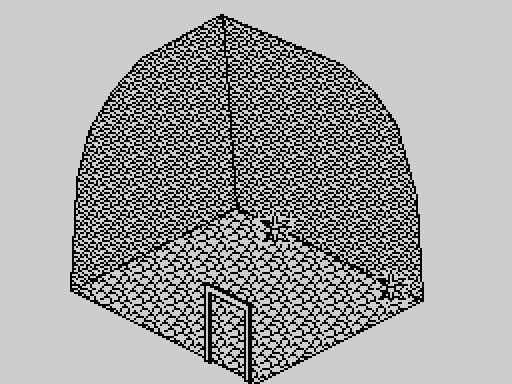]
```
c743: d6 ff 0d ; include template
c746: 32 64 ; pen to (y, x)
c748: dc 39 ; textured flood fill
c74a: d5 01 30 5c 32 ; place doorway (type, x, y, z)
c74f: e7 01 19 c8 6e 66 ; room exit
```

## TEMPLATE 1b
[]
```
c755: d6 ff 0e ; include template
c758: d1 00 ; set drawing flags (C024)
c75a: 96 e4 ; pen to (y, x)
c75c: dc 3a ; textured flood fill
c75e: d5 03 38 5c 5e ; place doorway (type, x, y, z)
c763: e7 01 17 36 5c 36 ; room exit
c769: e7 02 24 64 5c b4 ; room exit
```

## TEMPLATE 1c
[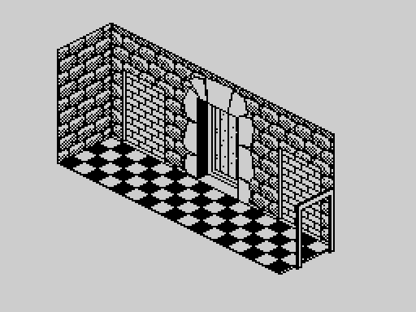]
```
c76f: 7f 7e ; pen to (y, x)
c771: d6 36 ; include template
c773: d1 40 ; set drawing flags (C024)
c775: d6 ff 0c ; include template
c778: d1 24 ; set drawing flags (C024)
c77a: da 5b 23 ; move line start
c77d: a1 23 ; pen to (y, x)
c77f: b1 44 ; pen to (y, x)
c781: 6d cd ; pen to (y, x)
c783: 28 cd ; pen to (y, x)
c785: da b1 44 ; move line start
c788: 6c 44 ; pen to (y, x)
c78a: d1 00 ; set drawing flags (C024)
c78c: 5b 64 ; pen to (y, x)
c78e: d6 38 ; include template
c790: 2b c4 ; pen to (y, x)
c792: d6 38 ; include template
c794: 96 64 ; pen to (y, x)
c796: dc 35 ; textured flood fill
c798: 96 42 ; pen to (y, x)
c79a: dc ff 10 ; textured flood fill
c79d: 8a 5e ; pen to (y, x)
c79f: dc 36 ; textured flood fill
c7a1: 5c b8 ; pen to (y, x)
c7a3: dc 36 ; textured flood fill
c7a5: 3c 64 ; pen to (y, x)
c7a7: dc ff 0a ; textured flood fill
c7aa: c2 14 ; set room bounding box (preset)
c7ac: d5 00 7e 5c 6e ; place doorway (type, x, y, z)
c7b1: d5 03 66 5c 30 ; place doorway (type, x, y, z)
c7b6: e7 01 1d 34 5c 66 ; room exit
c7bc: e7 02 17 58 5c 88 ; room exit
```

## TEMPLATE 1d
[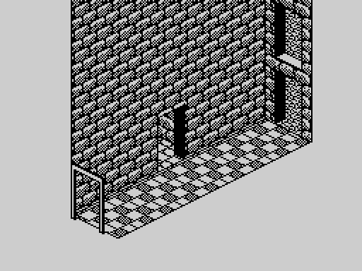]
```
c7c2: d6 fe 0c 00 ; include template
c7c6: 5d d4 ; pen to (y, x)
c7c8: d6 37 ; include template
c7ca: 8c d4 ; pen to (y, x)
c7cc: d6 37 ; include template
c7ce: 43 71 ; pen to (y, x)
c7d0: d6 ff 15 ; include template
c7d3: d1 20 ; set drawing flags (C024)
c7d5: da 28 32 ; move line start
c7d8: bf 32 ; pen to (y, x)
c7da: da 6c bb ; move line start
c7dd: bf bb ; pen to (y, x)
c7df: da 5c dc ; move line start
c7e2: bf dc ; pen to (y, x)
c7e4: da 95 d4 ; move line start
c7e7: 9b c8 ; pen to (y, x)
c7e9: da 8e d4 ; move line start
c7ec: 97 c3 ; pen to (y, x)
c7ee: e4 28 ; flag 20: pen down
c7f0: 7b cd ; pen to (y, x)
c7f2: dc 29 ; textured flood fill
c7f4: 9a cd ; pen to (y, x)
c7f6: dc 29 ; textured flood fill
c7f8: be c8 ; pen to (y, x)
c7fa: dc 35 ; textured flood fill
c7fc: be 6e ; pen to (y, x)
c7fe: dc ff 10 ; textured flood fill
c801: 49 70 ; pen to (y, x)
c803: dc 3a ; textured flood fill
c805: 32 64 ; pen to (y, x)
c807: dc 2c ; textured flood fill
c809: d5 01 30 5c 66 ; place doorway (type, x, y, z)
c80e: d5 00 be 5c 66 ; place doorway (type, x, y, z)
c813: d5 02 6e 5c 7c ; place doorway (type, x, y, z)
c818: e7 01 1c 7c 5c 6e ; room exit
c81e: e7 02 1f 34 5c 36 ; room exit
c824: e7 03 20 6e 5c 7a ; room exit
```

## TEMPLATE 1e
[]
```
c82a: c4 ; line start = pen
c82b: d7 37 ; include template (save/restore state)
c82d: e1 29 ; flag 10: relative coords
c82f: e4 29 ; flag 20: pen down
c831: da 0f f4 ; move line start
c834: 09 00 ; pen to (y, x)
c836: e4 28 ; flag 20: pen down
c838: 09 00 ; pen to (y, x)
c83a: dc ff 0e ; textured flood fill
```

## TEMPLATE 1f
[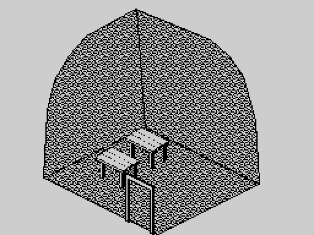]
```
c83d: d6 3a ; include template
c83f: 1e 64 ; pen to (y, x)
c841: dc 29 ; textured flood fill
c843: d5 01 30 5c 32 ; place doorway (type, x, y, z)
c848: e7 01 1d b8 5c 66 ; room exit
```

## TEMPLATE 20
[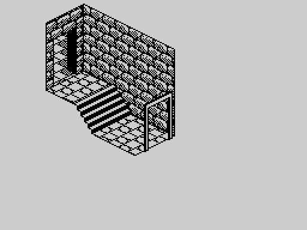]
```
c84e: 77 2d ; pen to (y, x)
c850: e5 29 ; flag 40: mirror x
c852: d6 37 ; include template
c854: 53 b6 ; pen to (y, x)
c856: d7 2b ; include template (save/restore state)
c858: d1 24 ; set drawing flags (C024)
c85a: da 5f 6e ; move line start
c85d: 4e 91 ; pen to (y, x)
c85f: 3e 70 ; pen to (y, x)
c861: 4f 4e ; pen to (y, x)
c863: da 79 5c ; move line start
c866: 84 45 ; pen to (y, x)
c868: 74 26 ; pen to (y, x)
c86a: 69 3d ; pen to (y, x)
c86c: da 74 26 ; move line start
c86f: ac 26 ; pen to (y, x)
c871: bc 45 ; pen to (y, x)
c873: 85 45 ; pen to (y, x)
c875: da bc 45 ; move line start
c878: 96 91 ; pen to (y, x)
c87a: 4f 91 ; pen to (y, x)
c87c: e4 28 ; flag 20: pen down
c87e: e2 28 ; flag 04: chain lines
c880: 4e 8c ; pen to (y, x)
c882: dc 3a ; textured flood fill
c884: 6d 42 ; pen to (y, x)
c886: dc 3a ; textured flood fill
c888: 52 8c ; pen to (y, x)
c88a: dc 35 ; textured flood fill
c88c: aa 33 ; pen to (y, x)
c88e: dc ff 10 ; textured flood fill
c891: a0 33 ; pen to (y, x)
c893: dc 2c ; textured flood fill
c895: c2 15 ; set room bounding box (preset)
c897: d5 03 6e 5c 76 ; place doorway (type, x, y, z)
c89c: d5 02 6e 6e ba ; place doorway (type, x, y, z)
c8a1: e7 01 1d 6e 5c 7c ; room exit
c8a7: e7 02 21 6e 5c 36 ; room exit
c8ad: c3 68 34 9c ; set object position
c8b1: ee 05 23 ff 9c 1f ; evaluate expression
c8b7: ee 05 2e ff 34 1f ; evaluate expression
c8bd: ee 04 2f 2d 1f ; evaluate expression
c8c2: d6 ff 55 ; include template
```

## TEMPLATE 21
[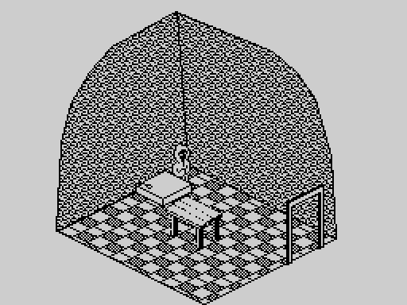]
```
c8c5: d6 3a ; include template
c8c7: 32 80 ; pen to (y, x)
c8c9: dc 2c ; textured flood fill
c8cb: d5 03 64 5c 30 ; place doorway (type, x, y, z)
c8d0: e7 01 20 64 74 b4 ; room exit
```

## TEMPLATE 22
[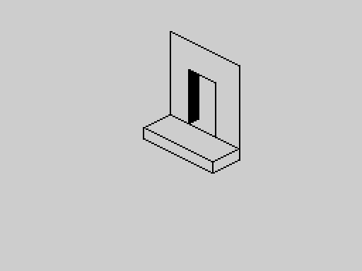]
```
c8d6: d6 ff 73 ; include template
c8d9: da 0a 14 ; move line start
c8dc: 01 01 ; pen to (y, x)
c8de: a8 31 ; pen to (y, x)
c8e0: 09 13 ; pen to (y, x)
c8e2: 18 cf ; pen to (y, x)
c8e4: 3b 00 ; pen to (y, x)
c8e6: a8 31 ; pen to (y, x)
c8e8: 7d 00 ; pen to (y, x)
c8ea: b7 ed ; pen to (y, x)
c8ec: 07 00 ; pen to (y, x)
c8ee: b9 00 ; pen to (y, x)
c8f0: 18 cf ; pen to (y, x)
c8f2: 08 00 ; pen to (y, x)
c8f4: e2 28 ; flag 04: chain lines
c8f6: e4 28 ; flag 20: pen down
c8f8: b8 32 ; pen to (y, x)
c8fa: d6 37 ; include template
```

## TEMPLATE 23
[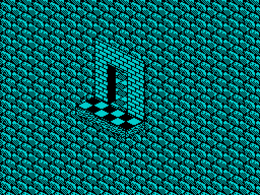]
```
c8fc: d0 28 ; set attribute
c8fe: 56 49 ; pen to (y, x)
c900: d7 fe 22 00 ; include template (save/restore state)
c904: 61 73 ; pen to (y, x)
c906: dc 2c ; textured flood fill
c908: 83 63 ; pen to (y, x)
c90a: dc 36 ; textured flood fill
c90c: 47 61 ; pen to (y, x)
c90e: dc 29 ; textured flood fill
c910: 50 6a ; pen to (y, x)
c912: dc ff 0a ; textured flood fill
c915: 40 80 ; pen to (y, x)
c917: dc 29 ; textured flood fill
c919: 00 00 ; pen to (y, x)
c91b: dc 35 ; textured flood fill
c91d: c2 0c ; set room bounding box (preset)
```

## TEMPLATE 24
[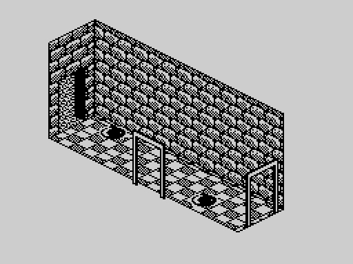]
```
c91f: d6 fe 13 00 ; include template
c923: 83 34 ; pen to (y, x)
c925: dc 29 ; textured flood fill
c927: 32 8c ; pen to (y, x)
c929: dc 2c ; textured flood fill
c92b: d5 01 5c 5c 64 ; place doorway (type, x, y, z)
c930: e7 01 1b 38 5c 62 ; room exit
c936: e7 02 0f 76 5c 6c ; room exit
c93c: d5 03 64 5c 32 ; place doorway (type, x, y, z)
c941: e7 03 26 32 5c ac ; room exit
```

## TEMPLATE 25
[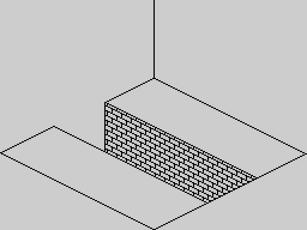]
```
c947: e2 29 ; flag 04: chain lines
c949: e4 29 ; flag 20: pen down
c94b: da 00 80 ; move line start
c94e: 40 00 ; pen to (y, x)
c950: 56 2c ; pen to (y, x)
c952: 16 ac ; pen to (y, x)
c954: 00 81 ; pen to (y, x)
c956: da 41 57 ; move line start
c959: 6a 57 ; pen to (y, x)
c95b: 2b d6 ; pen to (y, x)
c95d: 3f ff ; pen to (y, x)
c95f: 7e 80 ; pen to (y, x)
c961: 6a 57 ; pen to (y, x)
c963: da 16 ad ; move line start
c966: 2b d6 ; pen to (y, x)
c968: da 7f 80 ; move line start
c96b: bf 80 ; pen to (y, x)
c96d: e2 28 ; flag 04: chain lines
c96f: e4 28 ; flag 20: pen down
c971: 46 59 ; pen to (y, x)
c973: dc 36 ; textured flood fill
c975: c2 16 ; set room bounding box (preset)
c977: c1 20 00 88 32 32 ; place object (type, flags, x, y, z)
c97d: c1 20 00 a2 32 32 ; place object (type, flags, x, y, z)
c983: c1 20 00 40 32 32 ; place object (type, flags, x, y, z)
c989: c1 20 00 32 32 32 ; place object (type, flags, x, y, z)
c98f: d5 02 40 5c ae ; place doorway (type, x, y, z)
c994: e9 fe 24 9d ff 07 ; POKE byte
```

## TEMPLATE 26
[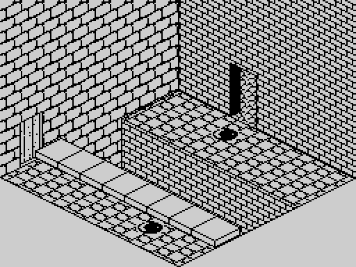]
```
c99a: d5 00 ac 5c 78 ; place doorway (type, x, y, z)
c99f: 61 b7 ; pen to (y, x)
c9a1: d6 37 ; include template
c9a3: d6 ff 25 ; include template
c9a6: 4f 1f ; pen to (y, x)
c9a8: e5 29 ; flag 40: mirror x
c9aa: d7 ff 4c ; include template (save/restore state)
c9ad: e5 28 ; flag 40: mirror x
c9af: 96 21 ; pen to (y, x)
c9b1: dc 2a ; textured flood fill
c9b3: 65 b6 ; pen to (y, x)
c9b5: dc 39 ; textured flood fill
c9b7: 65 64 ; pen to (y, x)
c9b9: dc ff 0d ; textured flood fill
c9bc: 32 32 ; pen to (y, x)
c9be: dc ff 0d ; textured flood fill
c9c1: b4 c8 ; pen to (y, x)
c9c3: dc 36 ; textured flood fill
c9c5: e7 01 27 5e 6e 98 ; room exit
c9cb: e7 02 24 66 5c 36 ; room exit
c9d1: d6 ff 57 ; include template
```

## TEMPLATE 27
[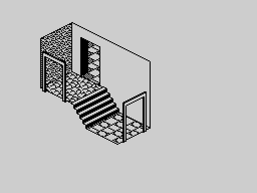]
```
c9d4: 69 62 ; pen to (y, x)
c9d6: d6 37 ; include template
c9d8: 43 52 ; pen to (y, x)
c9da: e5 29 ; flag 40: mirror x
c9dc: d7 2b ; include template (save/restore state)
c9de: d1 24 ; set drawing flags (C024)
c9e0: da 69 66 ; move line start
c9e3: 78 47 ; pen to (y, x)
c9e5: 68 28 ; pen to (y, x)
c9e7: 5a 45 ; pen to (y, x)
c9e9: da 4f 77 ; move line start
c9ec: 40 95 ; pen to (y, x)
c9ee: 30 75 ; pen to (y, x)
c9f0: 3f 56 ; pen to (y, x)
c9f2: da 78 47 ; move line start
c9f5: a9 47 ; pen to (y, x)
c9f7: da 69 28 ; move line start
c9fa: 99 28 ; pen to (y, x)
c9fc: a9 47 ; pen to (y, x)
c9fe: 82 95 ; pen to (y, x)
ca00: 40 95 ; pen to (y, x)
ca02: d1 00 ; set drawing flags (C024)
ca04: 6f 5d ; pen to (y, x)
ca06: dc 2c ; textured flood fill
ca08: 64 5a ; pen to (y, x)
ca0a: dc 39 ; textured flood fill
ca0c: 4c 78 ; pen to (y, x)
ca0e: dc 3a ; textured flood fill
ca10: 78 42 ; pen to (y, x)
ca12: dc 29 ; textured flood fill
ca14: c2 17 ; set room bounding box (preset)
ca16: d5 00 78 6e 98 ; place doorway (type, x, y, z)
ca1b: d5 03 60 5c 66 ; place doorway (type, x, y, z)
ca20: d5 01 5a 6e 98 ; place doorway (type, x, y, z)
ca25: e7 01 28 36 5c 66 ; room exit
ca2b: e7 02 29 64 64 b4 ; room exit
ca31: e7 03 26 ac 5c 6e ; room exit
ca37: c3 5c 34 86 ; set object position
ca3b: ee 05 23 ff 86 1f ; evaluate expression
ca41: ee 05 2e ff 34 1f ; evaluate expression
ca47: ee 04 2f 2d 1f ; evaluate expression
ca4c: d6 ff 55 ; include template
```

## TEMPLATE 28
[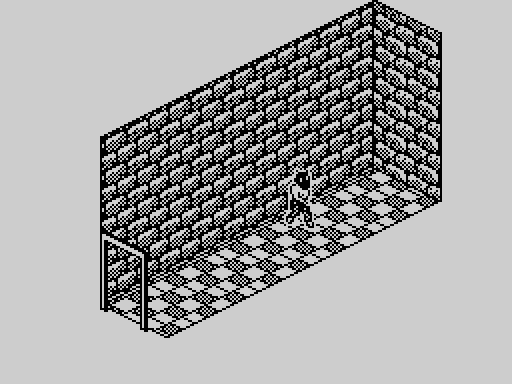]
```
ca4f: d7 fe 0c 00 ; include template (save/restore state)
ca53: d1 24 ; set drawing flags (C024)
ca55: da 28 32 ; move line start
ca58: 7b 32 ; pen to (y, x)
ca5a: bf ba ; pen to (y, x)
ca5c: 6c ba ; pen to (y, x)
ca5e: da 5b dc ; move line start
ca61: af dc ; pen to (y, x)
ca63: bf bb ; pen to (y, x)
ca65: d1 00 ; set drawing flags (C024)
ca67: 43 6e ; pen to (y, x)
ca69: dc 2c ; textured flood fill
ca6b: 64 64 ; pen to (y, x)
ca6d: dc ff 10 ; textured flood fill
ca70: 64 cc ; pen to (y, x)
ca72: dc 35 ; textured flood fill
ca74: d5 01 30 5c 66 ; place doorway (type, x, y, z)
ca79: e7 01 27 78 6e 98 ; room exit
ca7f: c1 1c 00 bc 82 60 ; place object (type, flags, x, y, z)
```

## TEMPLATE 29
[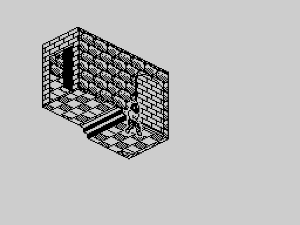]
```
ca85: 4e 46 ; pen to (y, x)
ca87: e5 29 ; flag 40: mirror x
ca89: d7 2a ; include template (save/restore state)
ca8b: e5 28 ; flag 40: mirror x
ca8d: 66 2c ; pen to (y, x)
ca8f: d7 fe 15 00 ; include template (save/restore state)
ca93: 5b 73 ; pen to (y, x)
ca95: d7 39 ; include template (save/restore state)
ca97: d1 24 ; set drawing flags (C024)
ca99: da 64 64 ; move line start
ca9c: 74 43 ; pen to (y, x)
ca9e: 64 24 ; pen to (y, x)
caa0: 55 43 ; pen to (y, x)
caa2: da 5a 6c ; move line start
caa5: 49 8f ; pen to (y, x)
caa7: 38 6e ; pen to (y, x)
caa9: 49 4b ; pen to (y, x)
caab: da 75 43 ; move line start
caae: a7 43 ; pen to (y, x)
cab0: da 4a 8f ; move line start
cab3: 82 8f ; pen to (y, x)
cab5: a8 42 ; pen to (y, x)
cab7: 99 24 ; pen to (y, x)
cab9: 65 24 ; pen to (y, x)
cabb: d1 00 ; set drawing flags (C024)
cabd: 6d 2c ; pen to (y, x)
cabf: dc 3a ; textured flood fill
cac1: 9e 32 ; pen to (y, x)
cac3: dc 37 ; textured flood fill
cac5: 56 7f ; pen to (y, x)
cac7: dc 36 ; textured flood fill
cac9: 81 7d ; pen to (y, x)
cacb: dc 35 ; textured flood fill
cacd: 46 64 ; pen to (y, x)
cacf: dc 2c ; textured flood fill
cad1: 56 42 ; pen to (y, x)
cad3: dc 2c ; textured flood fill
cad5: c2 18 ; set room bounding box (preset)
cad7: d5 02 68 64 b8 ; place doorway (type, x, y, z)
cadc: e7 01 27 64 5c 6a ; room exit
cae2: c3 62 36 96 ; set object position
cae6: ee 05 23 ff 96 1f ; evaluate expression
caec: ee 05 2e ff 36 1f ; evaluate expression
caf2: ee 04 2f 2a 1f ; evaluate expression
caf7: d6 ff 55 ; include template
```

## TEMPLATE 2a
[]
```
cafa: e4 29 ; flag 20: pen down
cafc: e2 29 ; flag 04: chain lines
cafe: da 4f 8f ; move line start
cb01: 64 64 ; pen to (y, x)
cb03: 53 42 ; pen to (y, x)
cb05: 3e 6c ; pen to (y, x)
cb07: 4f 8f ; pen to (y, x)
cb09: 99 8f ; pen to (y, x)
cb0b: ae 65 ; pen to (y, x)
cb0d: 64 65 ; pen to (y, x)
cb0f: da ad 64 ; move line start
cb12: 9c 42 ; pen to (y, x)
cb14: 54 42 ; pen to (y, x)
cb16: e2 28 ; flag 04: chain lines
cb18: e4 28 ; flag 20: pen down
cb1a: 96 64 ; pen to (y, x)
cb1c: dc 29 ; textured flood fill
cb1e: 96 82 ; pen to (y, x)
cb20: dc 29 ; textured flood fill
cb22: 4e 8a ; pen to (y, x)
cb24: dc ff 0c ; textured flood fill
cb27: c2 19 ; set room bounding box (preset)
```

## TEMPLATE 2b
[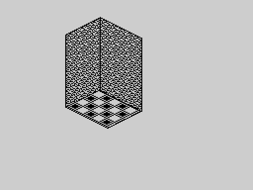]
```
cb29: d6 ff 2a ; include template
```

## TEMPLATE 2c
[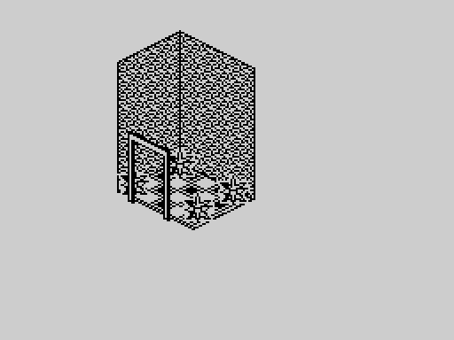]
```
cb2c: d6 ff 2a ; include template
cb2f: d5 01 64 5c 84 ; place doorway (type, x, y, z)
cb34: e7 01 2f 64 5c 78 ; room exit
```

## TEMPLATE 2d
[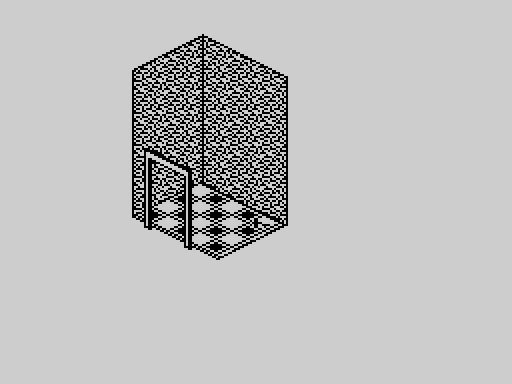]
```
cb3a: d6 ff 2a ; include template
cb3d: d5 01 64 5c 84 ; place doorway (type, x, y, z)
cb42: e7 01 2f 64 5c 44 ; room exit
```

## TEMPLATE 2e
[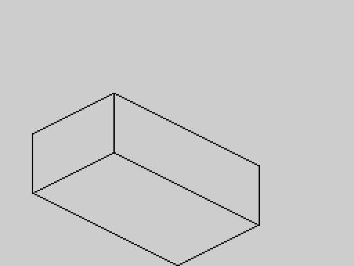]
```
cb48: d1 24 ; set drawing flags (C024)
cb4a: da 1d bb ; move line start
cb4d: 00 80 ; pen to (y, x)
cb4f: 34 17 ; pen to (y, x)
cb51: 51 52 ; pen to (y, x)
cb53: 1d bb ; pen to (y, x)
cb55: 48 bb ; pen to (y, x)
cb57: 7c 52 ; pen to (y, x)
cb59: 51 52 ; pen to (y, x)
cb5b: 7c 52 ; pen to (y, x)
cb5d: 5f 17 ; pen to (y, x)
cb5f: 34 17 ; pen to (y, x)
cb61: d1 00 ; set drawing flags (C024)
cb63: c2 1a ; set room bounding box (preset)
```

## TEMPLATE 2f
[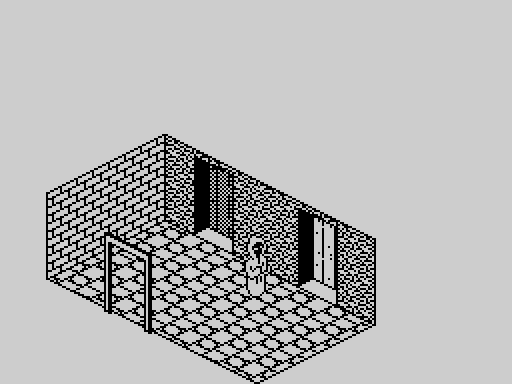]
```
cb65: d6 ff 2e ; include template
cb68: 40 73 ; pen to (y, x)
cb6a: d6 37 ; include template
cb6c: 26 a7 ; pen to (y, x)
cb6e: d6 37 ; include template
cb70: e4 29 ; flag 20: pen down
cb72: da 48 73 ; move line start
cb75: 4e 68 ; pen to (y, x)
cb77: da 34 9c ; move line start
cb7a: 2e a8 ; pen to (y, x)
cb7c: e4 28 ; flag 20: pen down
cb7e: 51 6a ; pen to (y, x)
cb80: dc ff 0b ; textured flood fill
cb83: 30 a6 ; pen to (y, x)
cb85: dc ff 0e ; textured flood fill
cb88: 73 5e ; pen to (y, x)
cb8a: dc 29 ; textured flood fill
cb8c: 52 50 ; pen to (y, x)
cb8e: dc 37 ; textured flood fill
cb90: 0a 80 ; pen to (y, x)
cb92: dc 3a ; textured flood fill
cb94: d5 01 30 5c 64 ; place doorway (type, x, y, z)
cb99: e7 01 10 76 5c 6c ; room exit
cb9f: d5 00 68 5c 44 ; place doorway (type, x, y, z)
cba4: d5 00 68 5c 78 ; place doorway (type, x, y, z)
cba9: e7 02 2d 68 5c 84 ; room exit
cbaf: e7 03 2c 68 5c 84 ; room exit
```

## TEMPLATE 30
[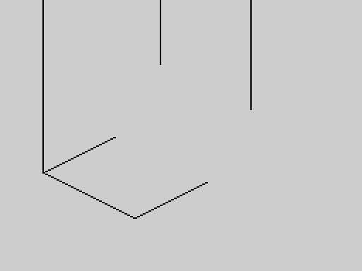]
```
cbb5: d1 24 ; set drawing flags (C024)
cbb7: da 5e 51 ; move line start
cbba: 45 1e ; pen to (y, x)
cbbc: 25 5f ; pen to (y, x)
cbbe: 3e 92 ; pen to (y, x)
cbc0: da 45 1e ; move line start
cbc3: bf 1e ; pen to (y, x)
cbc5: da 92 71 ; move line start
cbc8: bf 71 ; pen to (y, x)
cbca: da 72 b1 ; move line start
cbcd: bf b1 ; pen to (y, x)
cbcf: d1 00 ; set drawing flags (C024)
cbd1: c2 1b ; set room bounding box (preset)
cbd3: c1 1b 00 32 46 2c ; place object (type, flags, x, y, z)
cbd9: c1 1b 00 32 6e 2c ; place object (type, flags, x, y, z)
cbdf: c1 1b 00 32 5a 2c ; place object (type, flags, x, y, z)
```

## TEMPLATE 31
[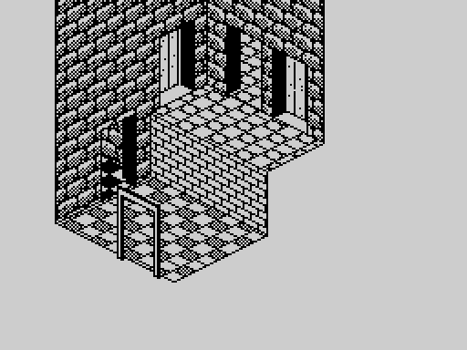]
```
cbe5: d6 ff 30 ; include template
cbe8: 83 58 ; pen to (y, x)
cbea: d7 ff 18 ; include template (save/restore state)
cbed: 74 a7 ; pen to (y, x)
cbef: d6 37 ; include template
cbf1: 81 8e ; pen to (y, x)
cbf3: d6 37 ; include template
cbf5: 4f 39 ; pen to (y, x)
cbf7: d7 ff 15 ; include template (save/restore state)
cbfa: d1 24 ; set drawing flags (C024)
cbfc: da 61 92 ; move line start
cbff: 3f 92 ; pen to (y, x)
cc01: 5f 52 ; pen to (y, x)
cc03: 82 52 ; pen to (y, x)
cc05: 91 71 ; pen to (y, x)
cc07: 71 b1 ; pen to (y, x)
cc09: 61 92 ; pen to (y, x)
cc0b: 81 53 ; pen to (y, x)
cc0d: da 82 9d ; move line start
cc10: 7d a7 ; pen to (y, x)
cc12: d1 00 ; set drawing flags (C024)
cc14: 7f a7 ; pen to (y, x)
cc16: dc ff 0e ; textured flood fill
cc19: 8c 7e ; pen to (y, x)
cc1b: dc 3a ; textured flood fill
cc1d: 59 5a ; pen to (y, x)
cc1f: dc 2c ; textured flood fill
cc21: 56 38 ; pen to (y, x)
cc23: dc ff 0a ; textured flood fill
cc26: 64 64 ; pen to (y, x)
cc28: dc 36 ; textured flood fill
cc2a: 64 91 ; pen to (y, x)
cc2c: dc 3a ; textured flood fill
cc2e: be 32 ; pen to (y, x)
cc30: dc ff 10 ; textured flood fill
cc33: be 81 ; pen to (y, x)
cc35: dc 35 ; textured flood fill
cc37: d5 01 44 5c 6c ; place doorway (type, x, y, z)
cc3c: d5 02 62 5c a8 ; place doorway (type, x, y, z)
cc41: c1 20 00 7c 54 68 ; place object (type, flags, x, y, z)
cc47: d5 00 98 7e 74 ; place doorway (type, x, y, z)
cc4c: d5 00 98 7e 8c ; place doorway (type, x, y, z)
cc51: d5 02 80 7e a6 ; place doorway (type, x, y, z)
cc56: e7 01 10 88 86 9a ; room exit
cc5c: e7 02 32 64 5c 36 ; room exit
cc62: e7 03 36 36 5c 6c ; room exit
cc68: e7 04 35 36 5c 3e ; room exit
cc6e: e7 05 38 64 5c 36 ; room exit
```

## TEMPLATE 32
[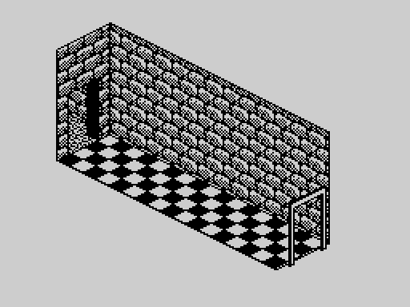]
```
cc74: 5c 2c ; pen to (y, x)
cc76: d7 ff 15 ; include template (save/restore state)
cc79: d6 ff 13 ; include template
cc7c: 64 2c ; pen to (y, x)
cc7e: dc 29 ; textured flood fill
cc80: 50 63 ; pen to (y, x)
cc82: dc ff 0a ; textured flood fill
cc85: d5 03 64 5c 30 ; place doorway (type, x, y, z)
cc8a: e7 01 33 6e 86 36 ; room exit
cc90: e7 02 31 62 5c a4 ; room exit
```

## TEMPLATE 33
[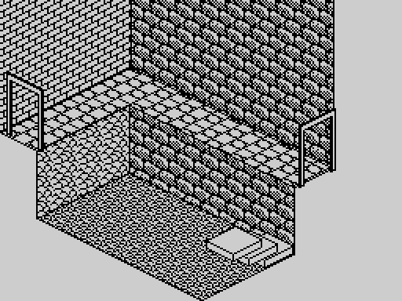]
```
cc96: d7 ff 2e ; include template (save/restore state)
cc99: d1 24 ; set drawing flags (C024)
cc9b: da 5f 17 ; move line start
cc9e: 6b 00 ; pen to (y, x)
cca0: 94 53 ; pen to (y, x)
cca2: 54 d4 ; pen to (y, x)
cca4: 48 bc ; pen to (y, x)
cca6: da 94 53 ; move line start
cca9: bf 53 ; pen to (y, x)
ccab: da 54 d4 ; move line start
ccae: bf d4 ; pen to (y, x)
ccb0: d1 00 ; set drawing flags (C024)
ccb2: 0a 80 ; pen to (y, x)
ccb4: dc 29 ; textured flood fill
ccb6: 50 46 ; pen to (y, x)
ccb8: dc 39 ; textured flood fill
ccba: 50 78 ; pen to (y, x)
ccbc: dc 35 ; textured flood fill
ccbe: 7e 52 ; pen to (y, x)
ccc0: dc 3a ; textured flood fill
ccc2: be 0a ; pen to (y, x)
ccc4: dc 37 ; textured flood fill
ccc6: be 96 ; pen to (y, x)
ccc8: dc 35 ; textured flood fill
ccca: c2 1c ; set room bounding box (preset)
cccc: c1 20 00 6e 5c 30 ; place object (type, flags, x, y, z)
ccd2: c1 1b 00 32 5c 9c ; place object (type, flags, x, y, z)
ccd8: d5 01 34 86 98 ; place doorway (type, x, y, z)
ccdd: d5 03 6e 86 30 ; place doorway (type, x, y, z)
cce2: e7 01 1b c8 6a 68 ; room exit
cce8: e7 02 32 64 5c b0 ; room exit
```

## TEMPLATE 34
[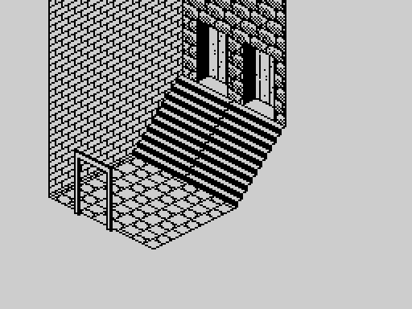]
```
ccee: d6 ff 30 ; include template
ccf1: 51 75 ; pen to (y, x)
ccf3: d7 2c ; include template (save/restore state)
ccf5: 41 95 ; pen to (y, x)
ccf7: d7 2c ; include template (save/restore state)
ccf9: 82 8c ; pen to (y, x)
ccfb: d7 ff 1e ; include template (save/restore state)
ccfe: 74 a9 ; pen to (y, x)
cd00: d7 ff 1e ; include template (save/restore state)
cd03: be 64 ; pen to (y, x)
cd05: dc 37 ; textured flood fill
cd07: be 82 ; pen to (y, x)
cd09: dc 35 ; textured flood fill
cd0b: 3c 64 ; pen to (y, x)
cd0d: dc 3a ; textured flood fill
cd0f: d5 01 44 5c 7e ; place doorway (type, x, y, z)
cd14: e7 01 10 a0 86 4e ; room exit
cd1a: c3 7a 34 68 ; set object position
cd1e: ee 05 23 ff 7a 1f ; evaluate expression
cd24: ee 05 2e ff 34 1f ; evaluate expression
cd2a: ee 04 2f 38 1f ; evaluate expression
cd2f: d6 ff 54 ; include template
cd32: d5 00 98 7a 6e ; place doorway (type, x, y, z)
cd37: d5 00 98 7a 8c ; place doorway (type, x, y, z)
cd3c: e7 02 47 60 5c a0 ; room exit
cd42: e7 03 44 38 5c 8c ; room exit
```

## TEMPLATE 35
[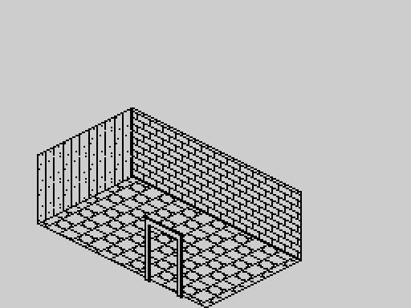]
```
cd48: d7 ff 2e ; include template (save/restore state)
cd4b: 3c 64 ; pen to (y, x)
cd4d: dc 3a ; textured flood fill
cd4f: 64 46 ; pen to (y, x)
cd51: dc ff 0e ; textured flood fill
cd54: 50 a0 ; pen to (y, x)
cd56: dc 36 ; textured flood fill
cd58: d5 01 30 5c 3e ; place doorway (type, x, y, z)
cd5d: e7 01 31 98 7e 8c ; room exit
```

## TEMPLATE 36
[]
```
cd63: d6 ff 0e ; include template
cd66: 9d e0 ; pen to (y, x)
cd68: dc ff 0a ; textured flood fill
cd6b: d5 01 30 5c 6a ; place doorway (type, x, y, z)
cd70: e7 01 37 4e 5c 6e ; room exit
cd76: e7 02 31 98 7e 74 ; room exit
```

## TEMPLATE 37
[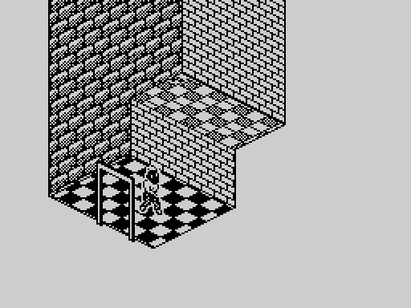]
```
cd7c: d6 ff 30 ; include template
cd7f: d1 24 ; set drawing flags (C024)
cd81: da 62 92 ; move line start
cd84: 72 b1 ; pen to (y, x)
cd86: 92 71 ; pen to (y, x)
cd88: 82 51 ; pen to (y, x)
cd8a: 5f 51 ; pen to (y, x)
cd8c: 3e 92 ; pen to (y, x)
cd8e: 62 92 ; pen to (y, x)
cd90: 82 52 ; pen to (y, x)
cd92: d1 00 ; set drawing flags (C024)
cd94: 73 74 ; pen to (y, x)
cd96: dc 2c ; textured flood fill
cd98: 58 59 ; pen to (y, x)
cd9a: dc ff 0a ; textured flood fill
cd9d: 64 64 ; pen to (y, x)
cd9f: dc 36 ; textured flood fill
cda1: 64 46 ; pen to (y, x)
cda3: dc ff 10 ; textured flood fill
cda6: b4 96 ; pen to (y, x)
cda8: dc 36 ; textured flood fill
cdaa: c1 20 00 7a 54 68 ; place object (type, flags, x, y, z)
cdb0: d5 01 44 5c 70 ; place doorway (type, x, y, z)
cdb5: e7 01 36 c8 6a 66 ; room exit
```

## TEMPLATE 38
[]
```
cdbb: 5c 2c ; pen to (y, x)
cdbd: d7 ff 15 ; include template (save/restore state)
cdc0: d6 ff 13 ; include template
cdc3: 59 64 ; pen to (y, x)
cdc5: dc 29 ; textured flood fill
cdc7: 65 30 ; pen to (y, x)
cdc9: dc 3a ; textured flood fill
cdcb: e7 01 39 64 5c 36 ; room exit
cdd1: d5 03 64 5c 30 ; place doorway (type, x, y, z)
cdd6: e7 02 31 80 7e a0 ; room exit
```

## TEMPLATE 39
[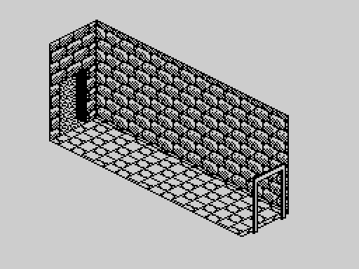]
```
cddc: d6 ff 13 ; include template
cddf: 65 30 ; pen to (y, x)
cde1: dc 29 ; textured flood fill
cde3: 3c 6c ; pen to (y, x)
cde5: dc 3a ; textured flood fill
cde7: e7 01 3a 78 5c 60 ; room exit
cded: d5 03 64 5c 30 ; place doorway (type, x, y, z)
cdf2: e7 02 38 64 5c b0 ; room exit
```

## TEMPLATE 3a
[]
```
cdf8: d6 ff 0e ; include template
cdfb: 9d e3 ; pen to (y, x)
cdfd: dc 29 ; textured flood fill
cdff: e7 01 3b 62 5c 3c ; room exit
ce05: d5 01 30 5c 68 ; place doorway (type, x, y, z)
ce0a: e7 02 41 6e 5c 36 ; room exit
ce10: d5 03 78 5c 5c ; place doorway (type, x, y, z)
ce15: e7 03 39 64 5c b0 ; room exit
```

## TEMPLATE 3b
[]
```
ce1b: d6 ff 13 ; include template
ce1e: 62 2c ; pen to (y, x)
ce20: dc 39 ; textured flood fill
ce22: 58 64 ; pen to (y, x)
ce24: dc 29 ; textured flood fill
ce26: e7 01 3d 4e 5c 6a ; room exit
ce2c: d5 01 5c 5c 3c ; place doorway (type, x, y, z)
ce31: e7 02 3a c8 6a 66 ; room exit
```

## TEMPLATE 3c
[]
```
ce37: d6 ff 30 ; include template
ce3a: e4 29 ; flag 20: pen down
ce3c: e2 29 ; flag 04: chain lines
ce3e: da 55 93 ; move line start
ce41: 3f 93 ; pen to (y, x)
ce43: 5f 52 ; pen to (y, x)
ce45: 76 52 ; pen to (y, x)
ce47: 55 93 ; pen to (y, x)
ce49: 64 b1 ; pen to (y, x)
ce4b: 71 b1 ; pen to (y, x)
ce4d: 65 b1 ; pen to (y, x)
ce4f: 85 71 ; pen to (y, x)
ce51: 92 71 ; pen to (y, x)
ce53: 85 71 ; pen to (y, x)
ce55: 76 52 ; pen to (y, x)
ce57: d1 00 ; set drawing flags (C024)
ce59: c1 20 00 7c 46 68 ; place object (type, flags, x, y, z)
```

## TEMPLATE 3d
[]
```
ce5f: d6 ff 3c ; include template
ce62: 75 8e ; pen to (y, x)
ce64: d7 ff 1e ; include template (save/restore state)
ce67: 76 50 ; pen to (y, x)
ce69: dc 37 ; textured flood fill
ce6b: be 96 ; pen to (y, x)
ce6d: dc 35 ; textured flood fill
ce6f: 55 8a ; pen to (y, x)
ce71: dc 35 ; textured flood fill
ce73: 30 6e ; pen to (y, x)
ce75: dc 39 ; textured flood fill
ce77: 6e 6e ; pen to (y, x)
ce79: dc 29 ; textured flood fill
ce7b: d5 00 98 70 8e ; place doorway (type, x, y, z)
ce80: d5 03 4e 5c 66 ; place doorway (type, x, y, z)
ce85: e7 01 3e 36 5c 6c ; room exit
ce8b: e7 02 3b 64 5c b0 ; room exit
```

## TEMPLATE 3e
[]
```
ce91: a0 9f ; pen to (y, x)
ce93: d7 36 ; include template (save/restore state)
ce95: d6 ff 25 ; include template
ce98: 1e 46 ; pen to (y, x)
ce9a: dc ff 0a ; textured flood fill
ce9d: 4a 9b ; pen to (y, x)
ce9f: dc ff 0a ; textured flood fill
cea2: be f0 ; pen to (y, x)
cea4: dc 29 ; textured flood fill
cea6: 96 64 ; pen to (y, x)
cea8: dc 2a ; textured flood fill
ceaa: d6 ff 57 ; include template
cead: d5 00 ae 5c 80 ; place doorway (type, x, y, z)
ceb2: d5 01 30 5c 6a ; place doorway (type, x, y, z)
ceb7: e7 01 40 68 5c 84 ; room exit
cebd: e7 02 3f 36 5c 34 ; room exit
cec3: e7 03 3d 98 70 8e ; room exit
```

## TEMPLATE 3f
[]
```
cec9: 85 56 ; pen to (y, x)
cecb: d7 ff 1e ; include template (save/restore state)
cece: d6 ff 0b ; include template
ced1: e7 01 40 68 5c 84 ; room exit
ced7: d5 01 30 5c 34 ; place doorway (type, x, y, z)
cedc: e7 02 3e aa 5c 80 ; room exit
cee2: c1 1d 00 5e 78 5a ; place object (type, flags, x, y, z)
```

## TEMPLATE 40
[]
```
cee8: d7 ff 2a ; include template (save/restore state)
ceeb: d5 01 64 5c 84 ; place doorway (type, x, y, z)
cef0: e7 01 3f 6c 90 9a ; room exit
```

## TEMPLATE 41
[]
```
cef6: 2d c0 ; pen to (y, x)
cef8: d7 ff 1e ; include template (save/restore state)
cefb: 5d 2b ; pen to (y, x)
cefd: d7 ff 18 ; include template (save/restore state)
cf00: d6 ff 13 ; include template
cf03: 36 73 ; pen to (y, x)
cf05: dc 29 ; textured flood fill
cf07: e7 01 42 4e 5c 6a ; room exit
cf0d: d5 00 7c 5c 3e ; place doorway (type, x, y, z)
cf12: e7 02 3a 36 5c 68 ; room exit
```

## TEMPLATE 42
[]
```
cf18: 77 58 ; pen to (y, x)
cf1a: d7 ff 18 ; include template (save/restore state)
cf1d: d6 ff 3c ; include template
cf20: aa 5f ; pen to (y, x)
cf22: dc 29 ; textured flood fill
cf24: be 96 ; pen to (y, x)
cf26: dc 29 ; textured flood fill
cf28: 55 8a ; pen to (y, x)
cf2a: dc 36 ; textured flood fill
cf2c: 30 6e ; pen to (y, x)
cf2e: dc 39 ; textured flood fill
cf30: 6e 6e ; pen to (y, x)
cf32: dc 39 ; textured flood fill
cf34: d5 03 4e 5c 66 ; place doorway (type, x, y, z)
cf39: e7 01 41 64 5c b0 ; room exit
cf3f: d5 02 80 70 a8 ; place doorway (type, x, y, z)
cf44: e7 02 43 66 5c 7c ; room exit
```

## TEMPLATE 43
[]
```
cf4a: d6 ff 2a ; include template
cf4d: d5 03 66 5c 78 ; place doorway (type, x, y, z)
cf52: e7 01 42 80 70 a4 ; room exit
```

## TEMPLATE 44
[]
```
cf58: d6 ff 45 ; include template
cf5b: 86 de ; pen to (y, x)
cf5d: d7 ff 1e ; include template (save/restore state)
cf60: d1 24 ; set drawing flags (C024)
cf62: da 37 ee ; move line start
cf65: bf ee ; pen to (y, x)
cf67: da 85 ed ; move line start
cf6a: 8e ff ; pen to (y, x)
cf6c: da a7 ee ; move line start
cf6f: b0 ff ; pen to (y, x)
cf71: da 83 ee ; move line start
cf74: 8c ff ; pen to (y, x)
cf76: d1 00 ; set drawing flags (C024)
cf78: be fd ; pen to (y, x)
cf7a: dc 2a ; textured flood fill
cf7c: 6e fd ; pen to (y, x)
cf7e: dc 2a ; textured flood fill
cf80: be dc ; pen to (y, x)
cf82: dc 39 ; textured flood fill
cf84: be e9 ; pen to (y, x)
cf86: dc 28 ; textured flood fill
cf88: 8e fb ; pen to (y, x)
cf8a: dc 2c ; textured flood fill
cf8c: e7 01 34 9a 7a 8c ; room exit
cf92: d5 00 e4 5c 8c ; place doorway (type, x, y, z)
cf97: e7 02 46 38 5c 8c ; room exit
```

## TEMPLATE 45
[]
```
cf9d: c1 1b 00 a6 32 82 ; place object (type, flags, x, y, z)
cfa3: c1 1d 00 32 32 8c ; place object (type, flags, x, y, z)
cfa9: d1 24 ; set drawing flags (C024)
cfab: da 00 80 ; move line start
cfae: 3f ff ; pen to (y, x)
cfb0: da 62 a6 ; move line start
cfb3: 82 e7 ; pen to (y, x)
cfb5: 93 c4 ; pen to (y, x)
cfb7: 73 84 ; pen to (y, x)
cfb9: 62 a6 ; pen to (y, x)
cfbb: 13 a6 ; pen to (y, x)
cfbd: da 72 84 ; move line start
cfc0: 02 84 ; pen to (y, x)
cfc2: da bf e7 ; move line start
cfc5: 34 e7 ; pen to (y, x)
cfc7: da 94 c5 ; move line start
cfca: bf c5 ; pen to (y, x)
cfcc: da bf 05 ; move line start
cfcf: 00 05 ; pen to (y, x)
cfd1: d1 00 ; set drawing flags (C024)
cfd3: b4 64 ; pen to (y, x)
cfd5: dc ff 10 ; textured flood fill
cfd8: 32 8c ; pen to (y, x)
cfda: dc 36 ; textured flood fill
cfdc: 32 a8 ; pen to (y, x)
cfde: dc 29 ; textured flood fill
cfe0: 01 01 ; pen to (y, x)
cfe2: dc 2b ; textured flood fill
cfe4: 78 96 ; pen to (y, x)
cfe6: dc 2c ; textured flood fill
cfe8: c2 1d ; set room bounding box (preset)
cfea: d5 01 36 5c 8c ; place doorway (type, x, y, z)
cfef: e9 fe 24 9d ff 07 ; POKE byte
```

## TEMPLATE 46
[]
```
cff5: d6 ff 45 ; include template
cff8: be dc ; pen to (y, x)
cffa: dc 36 ; textured flood fill
cffc: b4 fd ; pen to (y, x)
cffe: dc 2b ; textured flood fill
d000: e7 01 44 e0 5c 8c ; room exit
```

## TEMPLATE 47
[]
```
d006: d7 ff 13 ; include template (save/restore state)
d009: e4 29 ; flag 20: pen down
d00b: da 6b 35 ; move line start
d00e: 65 2a ; pen to (y, x)
d010: e4 28 ; flag 20: pen down
d012: 68 2d ; pen to (y, x)
d014: dc 37 ; textured flood fill
d016: 3c 80 ; pen to (y, x)
d018: dc 3a ; textured flood fill
d01a: d5 01 5c 5c a0 ; place doorway (type, x, y, z)
d01f: e7 01 34 90 80 6e ; room exit
d025: d5 03 64 5c 30 ; place doorway (type, x, y, z)
d02a: e7 02 48 32 5c aa ; room exit
d030: e9 fe ca 9d ff 01 ; POKE byte
```

## TEMPLATE 48
[]
```
d036: d6 ff 25 ; include template
d039: 48 ea ; pen to (y, x)
d03b: d7 ff 1e ; include template (save/restore state)
d03e: 4f 1f ; pen to (y, x)
d040: e5 29 ; flag 40: mirror x
d042: d7 ff 4c ; include template (save/restore state)
d045: e5 28 ; flag 40: mirror x
d047: be e6 ; pen to (y, x)
d049: dc 36 ; textured flood fill
d04b: 4f dc ; pen to (y, x)
d04d: dc 29 ; textured flood fill
d04f: 0a 80 ; pen to (y, x)
d051: dc 39 ; textured flood fill
d053: 96 64 ; pen to (y, x)
d055: dc 2a ; textured flood fill
d057: e7 01 47 64 5c 36 ; room exit
d05d: d5 00 ac 5c 40 ; place doorway (type, x, y, z)
d062: e7 02 49 36 5c 64 ; room exit
d068: d6 ff 57 ; include template
```

## TEMPLATE 49
[]
```
d06b: d6 ff 0b ; include template
d06e: 85 56 ; pen to (y, x)
d070: d7 ff 1e ; include template (save/restore state)
d073: d5 01 30 5c 64 ; place doorway (type, x, y, z)
d078: e7 01 4a 5c 5c a6 ; room exit
d07e: e7 02 48 a8 5c 42 ; room exit
```

## TEMPLATE 4a
[]
```
d084: e5 29 ; flag 40: mirror x
d086: d7 ff 0c ; include template (save/restore state)
d089: d1 20 ; set drawing flags (C024)
d08b: da 5b 23 ; move line start
d08e: bf 23 ; pen to (y, x)
d090: da 6c 44 ; move line start
d093: bf 44 ; pen to (y, x)
d095: da 27 cd ; move line start
d098: bf cd ; pen to (y, x)
d09a: e4 28 ; flag 20: pen down
d09c: bf 24 ; pen to (y, x)
d09e: dc 37 ; textured flood fill
d0a0: bf 45 ; pen to (y, x)
d0a2: dc 35 ; textured flood fill
d0a4: 26 c9 ; pen to (y, x)
d0a6: dc 29 ; textured flood fill
d0a8: d5 01 5a 5c a0 ; place doorway (type, x, y, z)
d0ad: d5 03 64 5c 30 ; place doorway (type, x, y, z)
d0b2: e7 01 49 68 90 9a ; room exit
d0b8: e7 02 4b 3c 5c aa ; room exit
d0be: e9 fe ca 9d ff 02 ; POKE byte
d0c4: c2 11 ; set room bounding box (preset)
```

## TEMPLATE 4b
[]
```
d0c6: 40 63 ; pen to (y, x)
d0c8: d7 2c ; include template (save/restore state)
d0ca: d1 24 ; set drawing flags (C024)
d0cc: da 6e 20 ; move line start
d0cf: 66 30 ; pen to (y, x)
d0d1: 7b 5a ; pen to (y, x)
d0d3: da 6e 7f ; move line start
d0d6: 48 cb ; pen to (y, x)
d0d8: da 3e 61 ; move line start
d0db: 4c 7e ; pen to (y, x)
d0dd: 70 7e ; pen to (y, x)
d0df: 4a cb ; pen to (y, x)
d0e1: 26 cb ; pen to (y, x)
d0e3: 00 80 ; pen to (y, x)
d0e5: 40 00 ; pen to (y, x)
d0e7: 4f 1f ; pen to (y, x)
d0e9: 47 30 ; pen to (y, x)
d0eb: 4e 3f ; pen to (y, x)
d0ed: da 4c 7e ; move line start
d0f0: 26 ca ; pen to (y, x)
d0f2: da 4f 1f ; move line start
d0f5: 70 1f ; pen to (y, x)
d0f7: 68 30 ; pen to (y, x)
d0f9: 7d 5a ; pen to (y, x)
d0fb: da 68 30 ; move line start
d0fe: 48 30 ; pen to (y, x)
d100: da 70 1f ; move line start
d103: 93 66 ; pen to (y, x)
d105: 55 e2 ; pen to (y, x)
d107: 4a cb ; pen to (y, x)
d109: da 93 66 ; move line start
d10c: af 66 ; pen to (y, x)
d10e: 8d 21 ; pen to (y, x)
d110: bf 21 ; pen to (y, x)
d112: da 92 21 ; move line start
d115: b4 66 ; pen to (y, x)
d117: 74 e7 ; pen to (y, x)
d119: 72 e2 ; pen to (y, x)
d11b: 56 e2 ; pen to (y, x)
d11d: 71 e2 ; pen to (y, x)
d11f: af 67 ; pen to (y, x)
d121: da 73 e7 ; move line start
d124: 34 e7 ; pen to (y, x)
d126: da 26 cc ; move line start
d129: 40 ff ; pen to (y, x)
d12b: d1 00 ; set drawing flags (C024)
d12d: b1 66 ; pen to (y, x)
d12f: dc 38 ; textured flood fill
d131: 49 83 ; pen to (y, x)
d133: d7 ff 4c ; include template (save/restore state)
d136: 31 e2 ; pen to (y, x)
d138: e5 29 ; flag 40: mirror x
d13a: d7 ff 4c ; include template (save/restore state)
d13d: e5 28 ; flag 40: mirror x
d13f: 41 06 ; pen to (y, x)
d141: d7 ff 18 ; include template (save/restore state)
d144: 78 04 ; pen to (y, x)
d146: dc 39 ; textured flood fill
d148: 96 88 ; pen to (y, x)
d14a: dc 29 ; textured flood fill
d14c: 52 e1 ; pen to (y, x)
d14e: dc 28 ; textured flood fill
d150: 6a 85 ; pen to (y, x)
d152: dc 29 ; textured flood fill
d154: 50 2e ; pen to (y, x)
d156: dc 29 ; textured flood fill
d158: 51 31 ; pen to (y, x)
d15a: dc 39 ; textured flood fill
d15c: 82 67 ; pen to (y, x)
d15e: dc 38 ; textured flood fill
d160: 5a 73 ; pen to (y, x)
d162: dc 39 ; textured flood fill
d164: 0a 80 ; pen to (y, x)
d166: dc 3a ; textured flood fill
d168: c2 01 ; set room bounding box (preset)
d16a: c1 20 00 94 5c 32 ; place object (type, flags, x, y, z)
d170: c1 20 00 94 86 32 ; place object (type, flags, x, y, z)
d176: d5 00 78 52 64 ; place doorway (type, x, y, z)
d17b: d5 02 36 5c ac ; place doorway (type, x, y, z)
d180: e7 01 4e 60 5c 6c ; room exit
d186: c1 20 00 7c 52 32 ; place object (type, flags, x, y, z)
d18c: c1 1c 00 4c 52 9c ; place object (type, flags, x, y, z)
d192: c3 60 36 7e ; set object position
d196: ee 05 23 ff 60 1f ; evaluate expression
d19c: ee 05 2e ff 36 1f ; evaluate expression
d1a2: ee 05 2f ff 08 1f ; evaluate expression
d1a8: d6 ff 54 ; include template
d1ab: e7 01 4e 7c 52 80 ; room exit
d1b1: e7 02 4a 64 5c 36 ; room exit
```

## TEMPLATE 4c
[]
```
d1b7: d6 ff 73 ; include template
d1ba: da 01 01 ; move line start
d1bd: 20 01 ; pen to (y, x)
d1bf: b8 10 ; pen to (y, x)
d1c1: a0 00 ; pen to (y, x)
d1c3: 08 f0 ; pen to (y, x)
d1c5: da 1e 02 ; move line start
d1c8: 01 02 ; pen to (y, x)
d1ca: b9 0e ; pen to (y, x)
d1cc: e4 28 ; flag 20: pen down
d1ce: e2 28 ; flag 04: chain lines
d1d0: 03 fd ; pen to (y, x)
d1d2: dc ff 0e ; textured flood fill
```

## TEMPLATE 4d
[]
```
d1d5: d7 ff 2e ; include template (save/restore state)
d1d8: 6f 76 ; pen to (y, x)
d1da: d7 2b ; include template (save/restore state)
d1dc: 5f 96 ; pen to (y, x)
d1de: d7 2b ; include template (save/restore state)
d1e0: 4b be ; pen to (y, x)
d1e2: d7 2b ; include template (save/restore state)
d1e4: 4f b6 ; pen to (y, x)
d1e6: d7 2b ; include template (save/restore state)
d1e8: 6b 7e ; pen to (y, x)
d1ea: d7 2b ; include template (save/restore state)
d1ec: e4 29 ; flag 20: pen down
d1ee: da 95 62 ; move line start
d1f1: bf 62 ; pen to (y, x)
d1f3: da 62 ca ; move line start
d1f6: bf ca ; pen to (y, x)
d1f8: da 5f 17 ; move line start
d1fb: bf 17 ; pen to (y, x)
d1fd: e4 28 ; flag 20: pen down
d1ff: 97 2e ; pen to (y, x)
d201: e5 29 ; flag 40: mirror x
d203: d7 ff 4c ; include template (save/restore state)
d206: e5 28 ; flag 40: mirror x
d208: 75 9e ; pen to (y, x)
d20a: d7 ff 1e ; include template (save/restore state)
d20d: 53 4f ; pen to (y, x)
d20f: e5 29 ; flag 40: mirror x
d211: d7 ff 4c ; include template (save/restore state)
d214: e5 28 ; flag 40: mirror x
d216: be 80 ; pen to (y, x)
d218: dc 29 ; textured flood fill
d21a: 5a 80 ; pen to (y, x)
d21c: dc 29 ; textured flood fill
d21e: 76 49 ; pen to (y, x)
d220: dc ff 07 ; textured flood fill
d223: be 1e ; pen to (y, x)
d225: dc 29 ; textured flood fill
d227: 32 80 ; pen to (y, x)
d229: dc 2c ; textured flood fill
d22b: c2 1e ; set room bounding box (preset)
d22d: d5 02 5a 5c 9a ; place doorway (type, x, y, z)
d232: d5 02 38 b2 9a ; place doorway (type, x, y, z)
d237: d5 00 7a 94 62 ; place doorway (type, x, y, z)
d23c: c1 20 00 6e 5c 32 ; place object (type, flags, x, y, z)
d242: e7 01 4e 7a 5c 6a ; room exit
d248: e7 02 4b 64 82 36 ; room exit
d24e: e7 03 4f 38 5c 60 ; room exit
d254: c3 6e 60 37 ; set object position
d258: ee 05 23 ff 6e 1f ; evaluate expression
d25e: ee 05 2e ff 60 1f ; evaluate expression
d264: ee 04 2f 2c 1f ; evaluate expression
d269: d6 ff 56 ; include template
```

## TEMPLATE 4e
[]
```
d26c: d1 24 ; set drawing flags (C024)
d26e: da 6f 54 ; move line start
d271: 47 a4 ; pen to (y, x)
d273: 3f 93 ; pen to (y, x)
d275: 67 44 ; pen to (y, x)
d277: 6f 53 ; pen to (y, x)
d279: 90 53 ; pen to (y, x)
d27b: 68 a4 ; pen to (y, x)
d27d: 48 a4 ; pen to (y, x)
d27f: da 90 53 ; move line start
d282: 88 43 ; pen to (y, x)
d284: 67 43 ; pen to (y, x)
d286: d1 00 ; set drawing flags (C024)
d288: 6f 51 ; pen to (y, x)
d28a: dc 37 ; textured flood fill
d28c: 6f 56 ; pen to (y, x)
d28e: dc 36 ; textured flood fill
d290: 6d 56 ; pen to (y, x)
d292: dc 29 ; textured flood fill
d294: c2 1f ; set room bounding box (preset)
d296: d5 01 78 5c 80 ; place doorway (type, x, y, z)
d29b: d5 03 7a 5c 66 ; place doorway (type, x, y, z)
d2a0: e7 01 4b 76 5c 64 ; room exit
d2a6: e7 02 4d 5a 5c 96 ; room exit
d2ac: e9 fe ca 9d ff 03 ; POKE byte
```

## TEMPLATE 4f
[]
```
d2b2: 26 76 ; pen to (y, x)
d2b4: d7 2b ; include template (save/restore state)
d2b6: 51 5f ; pen to (y, x)
d2b8: e5 29 ; flag 40: mirror x
d2ba: d7 2a ; include template (save/restore state)
d2bc: e5 28 ; flag 40: mirror x
d2be: 6c 80 ; pen to (y, x)
d2c0: d7 2a ; include template (save/restore state)
d2c2: 74 7b ; pen to (y, x)
d2c4: d7 ff 1e ; include template (save/restore state)
d2c7: d1 24 ; set drawing flags (C024)
d2c9: da 3d 83 ; move line start
d2cc: 4d a4 ; pen to (y, x)
d2ce: 5c 85 ; pen to (y, x)
d2d0: da 4d a4 ; move line start
d2d3: 57 a4 ; pen to (y, x)
d2d5: 6b 7b ; pen to (y, x)
d2d7: 6f 82 ; pen to (y, x)
d2d9: 71 82 ; pen to (y, x)
d2db: 6f 82 ; pen to (y, x)
d2dd: 5b ab ; pen to (y, x)
d2df: 57 a4 ; pen to (y, x)
d2e1: 5b ab ; pen to (y, x)
d2e3: bf ab ; pen to (y, x)
d2e5: da bf 62 ; move line start
d2e8: 83 62 ; pen to (y, x)
d2ea: da 78 5b ; move line start
d2ed: 68 3b ; pen to (y, x)
d2ef: 57 5e ; pen to (y, x)
d2f1: da 67 3b ; move line start
d2f4: 60 3b ; pen to (y, x)
d2f6: 4c 63 ; pen to (y, x)
d2f8: 38 3a ; pen to (y, x)
d2fa: 27 3a ; pen to (y, x)
d2fc: 32 51 ; pen to (y, x)
d2fe: 27 3a ; pen to (y, x)
d300: 17 5a ; pen to (y, x)
d302: 22 71 ; pen to (y, x)
d304: da 69 3b ; move line start
d307: bf 3b ; pen to (y, x)
d309: d1 00 ; set drawing flags (C024)
d30b: 64 64 ; pen to (y, x)
d30d: dc 3a ; textured flood fill
d30f: 42 7a ; pen to (y, x)
d311: dc 2c ; textured flood fill
d313: 28 64 ; pen to (y, x)
d315: dc 3a ; textured flood fill
d317: 3c 56 ; pen to (y, x)
d319: dc 39 ; textured flood fill
d31b: 53 56 ; pen to (y, x)
d31d: dc 28 ; textured flood fill
d31f: 62 8b ; pen to (y, x)
d321: dc 29 ; textured flood fill
d323: 66 8b ; pen to (y, x)
d325: dc 2c ; textured flood fill
d327: be 6e ; pen to (y, x)
d329: dc 29 ; textured flood fill
d32b: be 5a ; pen to (y, x)
d32d: dc 39 ; textured flood fill
d32f: c2 20 ; set room bounding box (preset)
d331: d5 01 34 5c 60 ; place doorway (type, x, y, z)
d336: d5 00 86 7c 84 ; place doorway (type, x, y, z)
d33b: e9 fe ca 9d ff 04 ; POKE byte
d341: c1 1c 00 2e aa 7e ; place object (type, flags, x, y, z)
d347: c1 1a 00 80 4a 5c ; place object (type, flags, x, y, z)
d34d: e7 01 4d 76 96 62 ; room exit
d353: e7 02 50 36 6e 6c ; room exit
d359: c3 4e 36 5c ; set object position
d35d: ee 05 23 ff 4e 1f ; evaluate expression
d363: ee 05 2e ff 36 1f ; evaluate expression
d369: ee 04 2f 2c 1f ; evaluate expression
d36e: d6 ff 54 ; include template
d371: c3 80 4e 84 ; set object position
d375: ee 05 23 ff 80 1f ; evaluate expression
d37b: ee 05 2e ff 4e 1f ; evaluate expression
d381: ee 04 2f 2c 1f ; evaluate expression
d386: d6 ff 54 ; include template
d389: c3 60 46 7c ; set object position
d38d: ee 05 23 ff 7c 1f ; evaluate expression
d393: ee 05 2e ff 46 1f ; evaluate expression
d399: ee 04 2f 2a 1f ; evaluate expression
d39e: d6 ff 55 ; include template
```

## TEMPLATE 50
[]
```
d3a1: 1f 4d ; pen to (y, x)
d3a3: d7 2b ; include template (save/restore state)
d3a5: 48 7b ; pen to (y, x)
d3a7: d7 2a ; include template (save/restore state)
d3a9: 5e 99 ; pen to (y, x)
d3ab: d7 2a ; include template (save/restore state)
d3ad: 69 a0 ; pen to (y, x)
d3af: d7 ff 53 ; include template (save/restore state)
d3b2: d1 24 ; set drawing flags (C024)
d3b4: da 46 3a ; move line start
d3b7: 53 55 ; pen to (y, x)
d3b9: da 5f 5e ; move line start
d3bc: 69 73 ; pen to (y, x)
d3be: da 7a 7f ; move line start
d3c1: 85 96 ; pen to (y, x)
d3c3: 75 b6 ; pen to (y, x)
d3c5: 6a 9f ; pen to (y, x)
d3c7: da 4f 7e ; move line start
d3ca: 59 93 ; pen to (y, x)
d3cc: da 36 5a ; move line start
d3cf: 44 76 ; pen to (y, x)
d3d1: da 2c 29 ; move line start
d3d4: 87 29 ; pen to (y, x)
d3d6: be 97 ; pen to (y, x)
d3d8: 84 97 ; pen to (y, x)
d3da: da bf 97 ; move line start
d3dd: ae b6 ; pen to (y, x)
d3df: 76 b6 ; pen to (y, x)
d3e1: d1 00 ; set drawing flags (C024)
d3e3: 81 9d ; pen to (y, x)
d3e5: d7 ff 4c ; include template (save/restore state)
d3e8: 52 54 ; pen to (y, x)
d3ea: dc 29 ; textured flood fill
d3ec: 69 74 ; pen to (y, x)
d3ee: dc 29 ; textured flood fill
d3f0: 83 97 ; pen to (y, x)
d3f2: dc 29 ; textured flood fill
d3f4: b7 9c ; pen to (y, x)
d3f6: dc 35 ; textured flood fill
d3f8: bb 94 ; pen to (y, x)
d3fa: dc ff 10 ; textured flood fill
d3fd: c2 21 ; set room bounding box (preset)
d3ff: d5 01 30 5c 6e ; place doorway (type, x, y, z)
d404: e7 01 4f 80 7e 84 ; room exit
d40a: d5 00 9c 80 6c ; place doorway (type, x, y, z)
d40f: e7 02 51 56 6c a6 ; room exit
d415: e9 fe ca 9d 3c ; POKE byte
d41a: c3 32 36 68 ; set object position
d41e: ee 05 23 ff 32 1f ; evaluate expression
d424: ee 05 2e ff 36 1f ; evaluate expression
d42a: ee 04 2f 2c 1f ; evaluate expression
d42f: d6 ff 54 ; include template
d432: c3 5e 46 68 ; set object position
d436: ee 05 23 ff 5e 1f ; evaluate expression
d43c: ee 05 2e ff 46 1f ; evaluate expression
d442: ee 04 2f 2a 1f ; evaluate expression
d447: d6 ff 54 ; include template
d44a: c3 7c 4e 68 ; set object position
d44e: ee 05 23 ff 7c 1f ; evaluate expression
d454: ee 05 2e ff 4e 1f ; evaluate expression
d45a: ee 04 2f 2b 1f ; evaluate expression
d45f: d6 ff 54 ; include template
```

## TEMPLATE 51
[]
```
d462: 3b 4e ; pen to (y, x)
d464: e5 29 ; flag 40: mirror x
d466: d7 2b ; include template (save/restore state)
d468: d1 24 ; set drawing flags (C024)
d46a: da 52 41 ; move line start
d46d: 69 13 ; pen to (y, x)
d46f: 91 64 ; pen to (y, x)
d471: 72 a3 ; pen to (y, x)
d473: 59 71 ; pen to (y, x)
d475: 5e 67 ; pen to (y, x)
d477: 59 72 ; pen to (y, x)
d479: 48 72 ; pen to (y, x)
d47b: 60 a3 ; pen to (y, x)
d47d: 72 a3 ; pen to (y, x)
d47f: 60 a3 ; pen to (y, x)
d481: 4c cb ; pen to (y, x)
d483: 24 7a ; pen to (y, x)
d485: 37 53 ; pen to (y, x)
d487: da 69 13 ; move line start
d48a: 97 13 ; pen to (y, x)
d48c: bf 64 ; pen to (y, x)
d48e: 92 64 ; pen to (y, x)
d490: bf 64 ; pen to (y, x)
d492: 8c cb ; pen to (y, x)
d494: 4d cb ; pen to (y, x)
d496: d1 00 ; set drawing flags (C024)
d498: 6b 15 ; pen to (y, x)
d49a: dc 29 ; textured flood fill
d49c: 6a 18 ; pen to (y, x)
d49e: dc ff 0a ; textured flood fill
d4a1: 8b ca ; pen to (y, x)
d4a3: dc 35 ; textured flood fill
d4a5: 55 73 ; pen to (y, x)
d4a7: dc 29 ; textured flood fill
d4a9: 55 71 ; pen to (y, x)
d4ab: dc 39 ; textured flood fill
d4ad: 49 7b ; pen to (y, x)
d4af: dc ff 0a ; textured flood fill
d4b2: c2 22 ; set room bounding box (preset)
d4b4: c1 01 00 8c 4c 9c ; place object (type, flags, x, y, z)
d4ba: c1 01 00 8c 4c 82 ; place object (type, flags, x, y, z)
d4c0: c1 05 00 8c 56 94 ; place object (type, flags, x, y, z)
d4c6: c1 05 00 8c 56 82 ; place object (type, flags, x, y, z)
d4cc: d5 01 50 6c a2 ; place doorway (type, x, y, z)
d4d1: d5 03 74 5c 56 ; place doorway (type, x, y, z)
d4d6: e7 01 50 98 80 6c ; room exit
d4dc: e7 02 52 64 5c 64 ; room exit
d4e2: c1 20 00 74 42 82 ; place object (type, flags, x, y, z)
d4e8: c1 20 00 8e 42 82 ; place object (type, flags, x, y, z)
d4ee: c3 52 36 82 ; set object position
d4f2: ee 05 23 ff 82 1f ; evaluate expression
d4f8: ee 05 2e ff 36 1f ; evaluate expression
d4fe: ee 04 2f 2c 1f ; evaluate expression
d503: d6 ff 55 ; include template
```

## TEMPLATE 52
[]
```
d506: d0 28 ; set attribute
d508: 5e 9c ; pen to (y, x)
d50a: e5 29 ; flag 40: mirror x
d50c: d7 ff 22 ; include template (save/restore state)
d50f: e5 28 ; flag 40: mirror x
d511: 63 76 ; pen to (y, x)
d513: dc ff 0a ; textured flood fill
d516: 8b 78 ; pen to (y, x)
d518: dc 2a ; textured flood fill
```

## TEMPLATE 53
[]
```
d51a: d6 ff 73 ; include template
d51d: da 00 fe ; move line start
d520: be fb ; pen to (y, x)
d522: 10 df ; pen to (y, x)
d524: bd 00 ; pen to (y, x)
d526: b0 21 ; pen to (y, x)
d528: 03 00 ; pen to (y, x)
d52a: da 02 03 ; move line start
d52d: 12 e3 ; pen to (y, x)
d52f: be fc ; pen to (y, x)
d531: e2 28 ; flag 04: chain lines
d533: e4 28 ; flag 20: pen down
d535: be 02 ; pen to (y, x)
d537: dc 2b ; textured flood fill
```

## TEMPLATE 54
```
d539: c1 1b 03 00 00 00 ; place object (type, flags, x, y, z)
d53f: ee 07 23 23 01 ff 04 1f ; evaluate expression
d547: ee 07 2e 2e 01 ff 04 1f ; evaluate expression
d54f: e9 fe 55 c0 23 ; POKE byte
d554: e9 fe 56 c0 2e ; POKE byte
d559: ce 2f ; decrement variable
d55b: ef 2f 0d 28 01 ; conditional skip
d560: fd ; loop back to start of template
d561: c3 00 00 00 ; set object position
```

## TEMPLATE 55
```
d565: c1 1b 02 00 00 00 ; place object (type, flags, x, y, z)
d56b: ee 07 23 23 01 ff 04 1f ; evaluate expression
d573: ee 07 2e 2e 01 ff 04 1f ; evaluate expression
d57b: e9 fe 57 c0 23 ; POKE byte
d580: e9 fe 56 c0 2e ; POKE byte
d585: ce 2f ; decrement variable
d587: ef 2f 0d 28 01 ; conditional skip
d58c: fd ; loop back to start of template
d58d: c3 00 00 00 ; set object position
```

## TEMPLATE 56
```
d591: c1 20 03 00 00 00 ; place object (type, flags, x, y, z)
d597: ee 07 23 23 01 ff 04 1f ; evaluate expression
d59f: ee 07 2e 2e 01 ff 04 1f ; evaluate expression
d5a7: e9 fe 55 c0 23 ; POKE byte
d5ac: e9 fe 56 c0 2e ; POKE byte
d5b1: ce 2f ; decrement variable
d5b3: ef 2f 0d 28 01 ; conditional skip
d5b8: fd ; loop back to start of template
d5b9: c3 00 00 00 ; set object position
```

## TEMPLATE 57
[]
```
d5bd: c1 1d 00 4c 38 a2 ; place object (type, flags, x, y, z)
d5c3: c1 1d 00 4c 38 92 ; place object (type, flags, x, y, z)
d5c9: c1 1d 00 4c 38 82 ; place object (type, flags, x, y, z)
d5cf: c1 1d 00 4c 38 72 ; place object (type, flags, x, y, z)
d5d5: c1 1d 00 4c 38 62 ; place object (type, flags, x, y, z)
d5db: c1 1d 00 4c 38 52 ; place object (type, flags, x, y, z)
d5e1: c1 1d 00 4c 38 42 ; place object (type, flags, x, y, z)
d5e7: c1 1d 00 4c 38 32 ; place object (type, flags, x, y, z)
```

## TEMPLATE 58 (empty)

## TEMPLATE 59 (empty)

## TEMPLATE 5a (empty)

## TEMPLATE 5b (empty)

## TEMPLATE 5c (empty)

## TEMPLATE 5d (empty)

## TEMPLATE 5e (empty)

## TEMPLATE 5f (empty)

## TEMPLATE 60 (empty)

## TEMPLATE 61 (empty)

## TEMPLATE 62 (empty)

## TEMPLATE 63 (empty)

## TEMPLATE 64
[]
```
d5ed: 05 25 ; pen to (y, x)
d5ef: c0 ; draw line from line start to pen
d5f0: 38 4a ; pen to (y, x)
d5f2: 9a 40 ; pen to (y, x)
d5f4: 0e 20 ; pen to (y, x)
d5f6: 80 34 ; pen to (y, x)
d5f8: 8d 37 ; pen to (y, x)
d5fa: 0e 20 ; pen to (y, x)
d5fc: 92 56 ; pen to (y, x)
d5fe: a0 21 ; pen to (y, x)
d600: 0e 20 ; pen to (y, x)
d602: 40 5c ; pen to (y, x)
d604: 62 2d ; pen to (y, x)
d606: 0e 20 ; pen to (y, x)
d608: 80 34 ; pen to (y, x)
d60a: 7a 29 ; pen to (y, x)
d60c: 0e 20 ; pen to (y, x)
d60e: 62 34 ; pen to (y, x)
d610: 74 fe ; pen to (y, x)
d612: 31 2a ; pen to (y, x)
d614: 00 00 ; pen to (y, x)
d616: 00 fe ; pen to (y, x)
d618: 03 00 ; pen to (y, x)
d61a: 00 00 ; pen to (y, x)
d61c: 00 fe ; pen to (y, x)
d61e: 03 00 ; pen to (y, x)
d620: 00 00 ; pen to (y, x)
d622: 00 fe ; pen to (y, x)
d624: 03 00 ; pen to (y, x)
d626: 00 00 ; pen to (y, x)
d628: 00 fe ; pen to (y, x)
d62a: 03 00 ; pen to (y, x)
d62c: 00 00 ; pen to (y, x)
d62e: 00 0f ; pen to (y, x)
d630: 25 c0 ; pen to (y, x)
d632: 34 4a ; pen to (y, x)
d634: 9a 0f ; pen to (y, x)
d636: 2e 2c ; pen to (y, x)
d638: 9c 66 ; pen to (y, x)
d63a: 88 0f ; pen to (y, x)
d63c: 2f a0 ; pen to (y, x)
d63e: 59 38 ; pen to (y, x)
d640: 46 10 ; pen to (y, x)
d642: 10 80 ; pen to (y, x)
d644: 60 50 ; pen to (y, x)
d646: 46 10 ; pen to (y, x)
d648: 25 c0 ; pen to (y, x)
d64a: 36 4a ; pen to (y, x)
d64c: 96 12 ; pen to (y, x)
d64e: 0d c0 ; pen to (y, x)
d650: 6a 50 ; pen to (y, x)
d652: 92 14 ; pen to (y, x)
d654: 12 c0 ; pen to (y, x)
d656: 56 4c ; pen to (y, x)
d658: 40 14 ; pen to (y, x)
d65a: 2c 00 ; pen to (y, x)
d65c: 60 40 ; pen to (y, x)
d65e: 5a 14 ; pen to (y, x)
d660: 2d 20 ; pen to (y, x)
d662: 5e 3a ; pen to (y, x)
d664: 72 14 ; pen to (y, x)
d666: 2d 20 ; pen to (y, x)
d668: 60 3a ; pen to (y, x)
d66a: 4a 14 ; pen to (y, x)
d66c: 2d 20 ; pen to (y, x)
d66e: 56 3a ; pen to (y, x)
d670: 60 16 ; pen to (y, x)
d672: 12 c0 ; pen to (y, x)
d674: 70 4c ; pen to (y, x)
d676: 66 19 ; pen to (y, x)
d678: 2f 80 ; pen to (y, x)
d67a: 7e 38 ; pen to (y, x)
d67c: 60 19 ; pen to (y, x)
d67e: 2f 80 ; pen to (y, x)
d680: a6 38 ; pen to (y, x)
d682: 74 1a ; pen to (y, x)
d684: 2e 2c ; pen to (y, x)
d686: 7a 3c ; pen to (y, x)
d688: 36 1a ; pen to (y, x)
d68a: 2e 2c ; pen to (y, x)
d68c: 7a 3c ; pen to (y, x)
d68e: 70 1b ; pen to (y, x)
d690: 12 c0 ; pen to (y, x)
d692: 6c 4c ; pen to (y, x)
d694: 64 1f ; pen to (y, x)
d696: 2c 00 ; pen to (y, x)
d698: 4a 40 ; pen to (y, x)
d69a: 66 1f ; pen to (y, x)
d69c: 2c 00 ; pen to (y, x)
d69e: 66 40 ; pen to (y, x)
d6a0: 6a 21 ; pen to (y, x)
d6a2: 33 00 ; pen to (y, x)
d6a4: 40 5a ; pen to (y, x)
d6a6: 5a 21 ; pen to (y, x)
d6a8: 2c 00 ; pen to (y, x)
d6aa: 54 40 ; pen to (y, x)
d6ac: 56 21 ; pen to (y, x)
d6ae: 10 80 ; pen to (y, x)
d6b0: 6e 50 ; pen to (y, x)
d6b2: 7c 24 ; pen to (y, x)
d6b4: 2f a0 ; pen to (y, x)
d6b6: 62 38 ; pen to (y, x)
d6b8: 4e 24 ; pen to (y, x)
d6ba: 2f a0 ; pen to (y, x)
d6bc: 72 38 ; pen to (y, x)
d6be: a0 26 ; pen to (y, x)
d6c0: 2f a0 ; pen to (y, x)
d6c2: 9a 38 ; pen to (y, x)
d6c4: 78 26 ; pen to (y, x)
d6c6: 2f a0 ; pen to (y, x)
d6c8: 3c 38 ; pen to (y, x)
d6ca: 50 28 ; pen to (y, x)
d6cc: 12 c0 ; pen to (y, x)
d6ce: 86 4c ; pen to (y, x)
d6d0: 70 29 ; pen to (y, x)
d6d2: 12 c0 ; pen to (y, x)
d6d4: 72 4c ; pen to (y, x)
d6d6: 80 2c ; pen to (y, x)
d6d8: 2e 2c ; pen to (y, x)
d6da: 7e 3c ; pen to (y, x)
d6dc: 98 2c ; pen to (y, x)
d6de: 2e 2c ; pen to (y, x)
d6e0: 7e 3c ; pen to (y, x)
d6e2: 7a 2c ; pen to (y, x)
d6e4: 2e 2c ; pen to (y, x)
d6e6: 6a 3c ; pen to (y, x)
d6e8: 7a 2c ; pen to (y, x)
d6ea: 2e 2c ; pen to (y, x)
d6ec: 66 3c ; pen to (y, x)
d6ee: 9a 2f ; pen to (y, x)
d6f0: 10 80 ; pen to (y, x)
d6f2: 5a 50 ; pen to (y, x)
d6f4: 5a 33 ; pen to (y, x)
d6f6: 33 00 ; pen to (y, x)
d6f8: 46 46 ; pen to (y, x)
d6fa: 32 33 ; pen to (y, x)
d6fc: 33 00 ; pen to (y, x)
d6fe: 50 3e ; pen to (y, x)
d700: 32 33 ; pen to (y, x)
d702: 33 00 ; pen to (y, x)
d704: 5a 38 ; pen to (y, x)
d706: 32 36 ; pen to (y, x)
d708: 10 80 ; pen to (y, x)
d70a: 6c 50 ; pen to (y, x)
d70c: 64 37 ; pen to (y, x)
d70e: 12 c0 ; pen to (y, x)
d710: 56 4c ; pen to (y, x)
d712: 78 38 ; pen to (y, x)
d714: 12 c0 ; pen to (y, x)
d716: 6e 4c ; pen to (y, x)
d718: 8e 3b ; pen to (y, x)
d71a: 0d c0 ; pen to (y, x)
d71c: 6a 50 ; pen to (y, x)
d71e: 9a 3d ; pen to (y, x)
d720: 12 c0 ; pen to (y, x)
d722: 56 4c ; pen to (y, x)
d724: 8c 3e ; pen to (y, x)
d726: 2f a0 ; pen to (y, x)
d728: 9a 38 ; pen to (y, x)
d72a: 78 3e ; pen to (y, x)
d72c: 2f a0 ; pen to (y, x)
d72e: 9a 38 ; pen to (y, x)
d730: a0 3f ; pen to (y, x)
d732: 09 24 ; pen to (y, x)
d734: 64 4c ; pen to (y, x)
d736: 64 3f ; pen to (y, x)
d738: 10 80 ; pen to (y, x)
d73a: 54 50 ; pen to (y, x)
d73c: 84 3f ; pen to (y, x)
d73e: 2b 26 ; pen to (y, x)
d740: 62 80 ; pen to (y, x)
d742: 60 3f ; pen to (y, x)
d744: 2c 00 ; pen to (y, x)
d746: 60 40 ; pen to (y, x)
d748: 5a 3f ; pen to (y, x)
d74a: 2d 20 ; pen to (y, x)
d74c: 62 3a ; pen to (y, x)
d74e: 4e 3f ; pen to (y, x)
d750: 2d 20 ; pen to (y, x)
d752: 56 3a ; pen to (y, x)
d754: 5e 40 ; pen to (y, x)
d756: 2e 2c ; pen to (y, x)
d758: 7e 3c ; pen to (y, x)
d75a: 98 40 ; pen to (y, x)
d75c: 2e 2c ; pen to (y, x)
d75e: 7e 3c ; pen to (y, x)
d760: 7a 40 ; pen to (y, x)
d762: 2e 2c ; pen to (y, x)
d764: 6a 3c ; pen to (y, x)
d766: 7a 40 ; pen to (y, x)
d768: 2e 2c ; pen to (y, x)
d76a: 66 3c ; pen to (y, x)
d76c: 9a 41 ; pen to (y, x)
d76e: 0d c0 ; pen to (y, x)
d770: 6a 50 ; pen to (y, x)
d772: 9a 42 ; pen to (y, x)
d774: 2c 00 ; pen to (y, x)
d776: 54 40 ; pen to (y, x)
d778: 78 42 ; pen to (y, x)
d77a: 09 00 ; pen to (y, x)
d77c: 5a 4a ; pen to (y, x)
d77e: 7c 44 ; pen to (y, x)
d780: 33 00 ; pen to (y, x)
d782: 66 2a ; pen to (y, x)
d784: 8c 46 ; pen to (y, x)
d786: 33 00 ; pen to (y, x)
d788: 66 2a ; pen to (y, x)
d78a: 8c 46 ; pen to (y, x)
d78c: 30 2d ; pen to (y, x)
d78e: c8 ; set window BRIGHT
d78f: 3c 96 ; pen to (y, x)
d791: 49 10 ; pen to (y, x)
d793: 80 54 ; pen to (y, x)
d795: 50 84 ; pen to (y, x)
d797: 4a 0d ; pen to (y, x)
d799: c0 ; draw line from line start to pen
d79a: 6e 50 ; pen to (y, x)
d79c: 8e 4b ; pen to (y, x)
d79e: 0d c0 ; pen to (y, x)
d7a0: 50 50 ; pen to (y, x)
d7a2: 50 4d ; pen to (y, x)
d7a4: 2c 00 ; pen to (y, x)
d7a6: 3c 40 ; pen to (y, x)
d7a8: 46 4d ; pen to (y, x)
d7aa: 2d 20 ; pen to (y, x)
d7ac: 34 3a ; pen to (y, x)
d7ae: 4e 4d ; pen to (y, x)
d7b0: 2d 20 ; pen to (y, x)
d7b2: 3a 3a ; pen to (y, x)
d7b4: 32 4e ; pen to (y, x)
d7b6: 10 80 ; pen to (y, x)
d7b8: 7c 4e ; pen to (y, x)
d7ba: 6a 4f ; pen to (y, x)
d7bc: 10 80 ; pen to (y, x)
d7be: 7c 68 ; pen to (y, x)
d7c0: 8a 50 ; pen to (y, x)
d7c2: 10 80 ; pen to (y, x)
d7c4: 92 6e ; pen to (y, x)
d7c6: 72 51 ; pen to (y, x)
d7c8: 32 20 ; pen to (y, x)
d7ca: 8c 5a ; pen to (y, x)
d7cc: 8c 51 ; pen to (y, x)
d7ce: 26 80 ; pen to (y, x)
d7d0: 74 5a ; pen to (y, x)
d7d2: a0 ff ; pen to (y, x)
d7d4: ff ; UNKNOWN
d7d5: ff ; UNKNOWN
d7d6: ff ; UNKNOWN
d7d7: ff ; UNKNOWN
d7d8: ff ; UNKNOWN
```

## TEMPLATE 65 (empty)
```
```

## TEMPLATE 66
[]
```
d7d9: d6 ff 71 ; include template
d7dc: ee 07 23 23 01 ff 20 1f ; evaluate expression
d7e4: ef 23 12 ff ff 01 ; conditional skip
d7ea: fd ; loop back to start of template
```

## TEMPLATE 67
```
d7eb: ee 0d 24 09 ff fe 28 05 ff 1f 07 ff 1f 1f ; evaluate expression
d7f9: ef 24 0d 28 01 ; conditional skip
d7fe: fd ; loop back to start of template
d7ff: ec 0f 30 20 54 4f 20 45 4e 44 20 47 41 4d 45 1f ; print text "0 TO END GAME"
```

## TEMPLATE 68
```
d80f: cf 22 ; increment variable
d811: dd 22 ; set border colour
d813: dd 22 ; set border colour
d815: cf 22 ; increment variable
d817: cf 22 ; increment variable
d819: cf 22 ; increment variable
d81b: dd 22 ; set border colour
d81d: ee 0d 24 09 ff fe 28 05 ff 1f 07 ff 1f 1f ; evaluate expression
d82b: ef 24 0f 28 01 ; conditional skip
d830: fd ; loop back to start of template
d831: ee 0e 22 09 ff fe ff bf 05 ff 1f 07 ff 1f 1f ; evaluate expression
d840: ef 22 0f ff 02 03 ; conditional skip
d846: d6 ff 84 ; include template
d849: ee 0e 22 09 ff fe ff fd 05 ff 1f 07 ff 1f 1f ; evaluate expression
d858: ef 22 0f ff 02 03 ; conditional skip
d85e: d6 ff 85 ; include template
d861: ee 0e 22 09 ff fe ff ef 05 ff 1f 07 ff 1f 1f ; evaluate expression
d870: dd 28 ; set border colour
d872: ef 22 0d ff 01 01 ; conditional skip
d878: cd ; return from template inclusion
d879: ee 06 24 fe e8 03 1f ; evaluate expression
```

## TEMPLATE 69 (empty)

## TEMPLATE 6a
```
d880: ec 03 42 1f ; print text "B"
d884: d6 ff 6b ; include template
```

## TEMPLATE 6b
```
d887: ec 08 4c 4f 43 4b 45 44 1f ; print text "LOCKED"
```

## TEMPLATE 6c
```
d890: ec 0b 54 4f 4f 20 48 45 41 56 59 1f ; print text "TOO HEAVY"
```

## TEMPLATE 6d
```
d89c: f9 ff c8 ff 64 ; beep (duration, pitch)
d8a1: d6 ff 8c ; include template
```

## TEMPLATE 6e
```
d8a4: d6 ff 6f ; include template
```

## TEMPLATE 6f
```
d8a7: d6 ff 8c ; include template
d8aa: ed 2d ff 60 ff bf ff 14 2b 33 ; define window
d8b4: de 2d ; select window
d8b6: d0 68 ; set attribute
d8b8: c6 ; set window attributes
d8b9: ee 12 23 0b fe 8e 7b 02 ff 8d 04 2a 03 ff 20 01 ff 40 1f ; evaluate expression
d8cc: ed 2d 23 ff bf 2c 2b 33 ; define window
d8d4: de 2d ; select window
d8d6: d0 78 ; set attribute
d8d8: c6 ; set window attributes
d8d9: ee 0e 22 ff 7b 03 fe 00 01 01 0b fe 8e 7b 1f ; evaluate expression
d8e8: ee 05 22 0a 22 1f ; evaluate expression
d8ee: ef 22 0f 28 01 ; conditional skip
d8f3: c5 ; clear window
d8f4: ef 22 0d 28 03 ; conditional skip
d8f9: d6 ff 70 ; include template
d8fc: ee 07 23 23 01 ff 18 1f ; evaluate expression
d904: d6 ff 71 ; include template
```

## TEMPLATE 70
```
d907: d2 00 ; set drawing flags (C023)
d909: d1 00 ; set drawing flags (C024)
d90b: fc ff bf 23 ; move line start (y, x operands)
d90f: ee 06 22 22 01 2a 1f ; evaluate expression
d916: ee 08 2e 0b 22 04 ff 08 1f ; evaluate expression
d91f: cf 22 ; increment variable
d921: ee 05 2f 0b 22 1f ; evaluate expression
d927: cf 22 ; increment variable
d929: ee 05 22 0a 22 1f ; evaluate expression
d92f: ef 2e 11 ff 18 06 ; conditional skip
d935: ee 05 2e ff 18 1f ; evaluate expression
d93b: f0 22 2e 2f ; draw sprite at cursor (address, width, height)
```

## TEMPLATE 71
[]
```
d93f: e9 fe 2c c0 ff 08 ; POKE byte
d945: fb ff bf 23 ; line to (y, x operands)
d949: ec 03 23 1f ; print text "#"
d94d: fb ff b7 23 ; line to (y, x operands)
d951: ec 03 24 1f ; print text "$"
d955: fb ff af 23 ; line to (y, x operands)
d959: ec 03 25 1f ; print text "%"
d95d: e9 fe 2c c0 ff 05 ; POKE byte
```

## TEMPLATE 72 (empty)

## TEMPLATE 73
```
d963: c4 ; line start = pen
d964: e1 29 ; flag 10: relative coords
d966: e2 29 ; flag 04: chain lines
d968: e4 29 ; flag 20: pen down
```

## TEMPLATE 74 (empty)
```
```

## TEMPLATE 75
```
d96a: ee 05 29 ff 01 1f ; evaluate expression
d970: ee 05 2a ff 02 1f ; evaluate expression
d976: ee 05 2b ff 03 1f ; evaluate expression
d97c: ee 05 2c ff 04 1f ; evaluate expression
d982: ee 05 2d ff 05 1f ; evaluate expression
d988: ee 05 36 ff 06 1f ; evaluate expression
d98e: ee 05 37 ff 07 1f ; evaluate expression
d994: ee 05 38 ff 08 1f ; evaluate expression
d99a: ee 05 39 ff 09 1f ; evaluate expression
d9a0: ee 05 3a ff 0d 1f ; evaluate expression
d9a6: ee 05 35 ff 0f 1f ; evaluate expression
d9ac: ee 0a 22 0a fe 08 c0 01 ff c8 1f ; evaluate expression
d9b7: ee 05 22 0a 22 1f ; evaluate expression
d9bd: fe fe 70 7b fe 00 a1 ff 64 ; block copy (dest, src, length)
d9c6: e9 fe 75 7b ff 23 ; POKE byte
d9cc: e9 fe 7b 7b ff ef ; POKE byte
d9d2: e9 fe aa 7b 22 ; POKE byte
d9d7: db fe 1e c0 fe 40 63 ; POKE word
d9de: d9 fe 44 61 ; set font
d9e2: e9 fe 2c c0 2d ; POKE byte
d9e7: db fe 5b c0 22 ; POKE word
d9ec: fe fe 00 bd 22 fe 00 03 ; block copy (dest, src, length)
d9f4: db fe 5f c0 fe 68 77 ; POKE word
d9fb: ed 2c ff 10 ff a7 ff 1c ff 13 ff 61 ; define window
da07: e9 fe 00 5b ff 8f ; POKE byte
da0d: db fe 01 5b 28 ; POKE word
da12: db fe 03 5b 28 ; POKE word
da17: db fe 05 5b 28 ; POKE word
da1c: db fe 07 5b 28 ; POKE word
da21: db fe 09 5b 28 ; POKE word
da26: db fe 0c 5b fe a4 9d ; POKE word
da2d: e9 fe 0e 5b ff 07 ; POKE byte
```

## TEMPLATE 76
```
da33: de 2b ; select window
da35: d8 fe f2 7b ; call machine code
da39: de 29 ; select window
da3b: d1 00 ; set drawing flags (C024)
da3d: d2 00 ; set drawing flags (C023)
da3f: af 10 ; pen to (y, x)
da41: ee 0b 24 09 ff fe ff 7f 05 ff 03 1f ; evaluate expression
da4d: ef 24 0f 28 03 ; conditional skip
da52: d6 ff 67 ; include template
da55: ef 24 0f 28 03 ; conditional skip
da5a: d6 ff 68 ; include template
da5d: ef 24 0f fe e8 03 01 ; conditional skip
da64: cd ; return from template inclusion
da65: ee 07 24 0b fe 85 7b 1f ; evaluate expression
da6d: ef 24 0f 28 01 ; conditional skip
da72: cd ; return from template inclusion
da73: ed 2d ff 08 ff b7 ff 09 2a 28 ; define window
da7d: ee 0a 22 0b fe 77 7b 01 ff 69 1f ; evaluate expression
da88: e9 fe 77 7b 28 ; POKE byte
da8d: ef 22 12 ff 6c 02 ; conditional skip
da93: de 2d ; select window
da95: ef 22 12 ff 6c 03 ; conditional skip
da9b: f7 ff 67 ; scroll window
da9e: ef 22 12 ff 6c 05 ; conditional skip
daa4: f9 ff 0a ff 0a ; beep (duration, pitch)
daa9: d6 22 ; include template
daab: de 29 ; select window
daad: ee 07 21 0b fe a4 7b 1f ; evaluate expression
dab5: ef 21 0f 20 01 ; conditional skip
daba: fd ; loop back to start of template
dabb: ef 21 0f ff 52 03 ; conditional skip
dac1: d7 ff 87 ; include template (save/restore state)
dac4: ef 21 0f ff 52 01 ; conditional skip
daca: cd ; return from template inclusion
dacb: d6 ff 77 ; include template
dace: fd ; loop back to start of template
```

## TEMPLATE 77
```
dacf: e9 fe 24 9d 28 ; POKE byte
dad4: ee 05 22 ff 7d 1f ; evaluate expression
dada: f9 ff 05 fe 58 02 ; beep (duration, pitch)
dae0: d6 ff 79 ; include template
dae3: de 2a ; select window
dae5: c5 ; clear window
dae6: ee 07 22 0b fe 70 7b 1f ; evaluate expression
daee: e9 fe 5e c0 22 ; POKE byte
daf3: ee 07 22 0a fe 58 c0 1f ; evaluate expression
dafb: fe 22 fe 00 a1 fe e8 03 ; block copy (dest, src, length)
db03: fe fe 68 5b fe a4 9d ff 78 ; block copy (dest, src, length)
db0c: fe fe a4 9d fe 00 a1 fe e8 03 ; block copy (dest, src, length)
db16: db fe 58 c0 fe a4 9d ; POKE word
db1d: de 29 ; select window
db1f: ee 04 20 21 1f ; evaluate expression
db24: e9 fe 5d c0 20 ; POKE byte
db29: e9 fe a4 7b 20 ; POKE byte
db2e: d1 00 ; set drawing flags (C024)
db30: d2 04 ; set drawing flags (C023)
db32: c3 00 00 00 ; set object position
db36: de 2a ; select window
db38: d0 38 ; set attribute
db3a: 64 64 ; pen to (y, x)
db3c: d6 20 ; include template
db3e: ee 04 20 21 1f ; evaluate expression
db43: c6 ; set window attributes
db44: eb ff 04 ff 03 ; copy window a to b
db49: c3 00 00 00 ; set object position
db4d: cb ; place room items
db4e: ee 07 2e 0a fe 58 c0 1f ; evaluate expression
db56: fe 2e fe 68 5b ff 78 ; block copy (dest, src, length)
db5d: ee 06 23 fe 8d 7b 1f ; evaluate expression
db64: d6 ff 78 ; include template
db67: db fe 58 c0 2e ; POKE word
db6c: ee 07 22 0b fe 5e c0 1f ; evaluate expression
db74: e9 fe 70 7b 22 ; POKE byte
db79: e9 fe 87 7b 2c ; POKE byte
db7e: e9 fe 83 7b 39 ; POKE byte
db83: de 2a ; select window
db85: da a7 ff ; move line start
db88: a7 10 ; pen to (y, x)
db8a: c0 ; draw line from line start to pen
db8b: de 29 ; select window
db8d: da a7 ff ; move line start
db90: a7 10 ; pen to (y, x)
db92: c0 ; draw line from line start to pen
```

## TEMPLATE 78
```
db93: cf 23 ; increment variable
db95: cf 23 ; increment variable
db97: ef 23 11 fe 99 7b 01 ; conditional skip
db9e: cd ; return from template inclusion
db9f: ee 05 2f 0a 23 1f ; evaluate expression
dba5: ef 2f 0f 28 01 ; conditional skip
dbaa: fd ; loop back to start of template
dbab: db 23 2e ; POKE word
dbae: ee 07 2e 2e 01 ff 14 1f ; evaluate expression
dbb6: fd ; loop back to start of template
```

## TEMPLATE 79
```
dbb7: f9 ff 0c ff 0a ; beep (duration, pitch)
dbbc: df 29 ; pause (0 = wait for key)
dbbe: f9 ff 04 22 ; beep (duration, pitch)
dbc2: ce 22 ; decrement variable
dbc4: ce 22 ; decrement variable
dbc6: ef 22 11 ff 78 01 ; conditional skip
dbcc: fd ; loop back to start of template
```

## TEMPLATE 7a (empty)

## TEMPLATE 7b (empty)

## TEMPLATE 7c (empty)

## TEMPLATE 7d
```
dbcd: de 29 ; select window
dbcf: d2 00 ; set drawing flags (C023)
dbd1: d1 00 ; set drawing flags (C024)
dbd3: 06 14 ; pen to (y, x)
dbd5: e0 20 ; print number
dbd7: ec 03 20 1f ; print text " "
dbdb: ee 07 20 0a fe 58 c0 1f ; evaluate expression
dbe3: e0 20 ; print number
dbe5: ec 03 20 1f ; print text " "
dbe9: ee 07 20 0b fe 5e c0 1f ; evaluate expression
dbf1: e0 20 ; print number
dbf3: ec 04 17 02 1f ; print text "<17><02>"
```

## TEMPLATE 7e (empty)

## TEMPLATE 7f (empty)

## TEMPLATE 80 (empty)

## TEMPLATE 81 (empty)

## TEMPLATE 82
[]
```
dbf8: d6 ff 71 ; include template
dbfb: ee 07 23 23 01 ff 20 1f ; evaluate expression
dc03: ef 23 12 fe 00 01 01 ; conditional skip
dc0a: fd ; loop back to start of template
```

## TEMPLATE 83
```
dc0b: de 29 ; select window
dc0d: ee 07 20 0a fe 5b c0 1f ; evaluate expression
dc15: fe 20 fe 00 bd fe fc 02 ; block copy (dest, src, length)
dc1d: fe fe 8e 7b fe 00 5b ff 0c ; block copy (dest, src, length)
dc26: fe fe 58 c0 fe 0c 5b 2a ; block copy (dest, src, length)
dc2e: fe fe 5e c0 fe 0e 5b 29 ; block copy (dest, src, length)
dc36: fe fe 70 7b fe 0e 5b 29 ; block copy (dest, src, length)
dc3e: fe fe a4 9d fe 0f 5b ff 64 ; block copy (dest, src, length)
dc47: ee 04 20 34 1f ; evaluate expression
dc4c: ee 04 21 20 1f ; evaluate expression
dc51: ee 05 24 ff 63 1f ; evaluate expression
dc57: e9 fe 79 7b ff 00 ; POKE byte
dc5d: e9 fe 7a 7b ff 0a ; POKE byte
dc63: e9 fe 82 7b 28 ; POKE byte
dc68: e9 fe 84 7b 28 ; POKE byte
dc6d: e9 fe 85 7b 24 ; POKE byte
dc72: e9 fe a4 7b 20 ; POKE byte
dc77: d7 ff 6d ; include template (save/restore state)
dc7a: ed 2b ff 60 ff bf ff 14 2b 28 ; define window
dc84: de 2b ; select window
dc86: d0 68 ; set attribute
dc88: c5 ; clear window
dc89: d7 ff 6f ; include template (save/restore state)
dc8c: ed 2b ff 10 ff a7 ff 1c ff 13 28 ; define window
dc97: de 29 ; select window
dc99: ee 05 23 ff 58 1f ; evaluate expression
dc9f: d6 ff 82 ; include template
dca2: ef 3b 0d 28 03 ; conditional skip
dca7: d6 ff 8a ; include template
dcaa: fe fe 18 9d fe 8c 9c ff 8c ; block copy (dest, src, length)
dcb3: d6 ff 77 ; include template
dcb6: d6 ff 76 ; include template
dcb9: fd ; loop back to start of template
```

## TEMPLATE 84
```
dcba: f8 fe 00 40 fe 40 b7 ; tape: load block (start, length)
```

## TEMPLATE 85
```
dcc1: c9 fe 00 40 fe 40 b7 ; tape: save block (start, length)
```

## TEMPLATE 86
```
dcc8: f8 fe 00 40 fe 00 1b ; tape: load block (start, length)
```

## TEMPLATE 87
```
dccf: de ff 01 ; select window
dcd2: d0 70 ; set attribute
dcd4: c5 ; clear window
dcd5: d9 fe 44 61 ; set font
dcd9: e9 fe 2c c0 ff 05 ; POKE byte
dcdf: 64 64 ; pen to (y, x)
dce1: ec 0d 50 52 45 53 53 20 50 4c 41 59 20 1f ; print text "PRESS PLAY "
dcef: df ff ff ; pause (0 = wait for key)
dcf2: df ff ff ; pause (0 = wait for key)
dcf5: d0 00 ; set attribute
dcf7: c5 ; clear window
dcf8: d6 ff 8f ; include template
dcfb: ed ff 03 ff 00 ff bf ff 20 ff 18 ff c0 ; define window
dd08: f4 ff 02 ff 03 ; XOR window a into b
dd0d: d8 fe 00 a1 ; call machine code
dd11: d6 ff 90 ; include template
```

## TEMPLATE 88
```
dd14: fe fe 9a 5b fe 00 fa fe e8 03 ; block copy (dest, src, length)
dd1e: e9 fe fa a7 ff 01 ; POKE byte
dd24: d8 fe f8 a7 ; call machine code
dd28: df 28 ; pause (0 = wait for key)
dd2a: fe fe 00 fa fe a4 9d fe 84 03 ; block copy (dest, src, length)
dd34: fe fe 84 fd fe 8e 7b ff 0c ; block copy (dest, src, length)
dd3d: ee 07 20 0a fe 58 c0 1f ; evaluate expression
dd45: db fe 90 fd 20 ; POKE word
dd4a: ee 07 20 0b fe 5e c0 1f ; evaluate expression
dd52: e9 fe 92 fd 20 ; POKE byte
dd57: d6 ff 85 ; include template
dd5a: de 29 ; select window
dd5c: d0 30 ; set attribute
dd5e: c5 ; clear window
dd5f: 64 64 ; pen to (y, x)
dd61: ec 0b 53 54 4f 50 20 54 41 50 45 1f ; print text "STOP TAPE"
dd6d: f9 fe d0 07 fe e8 03 ; beep (duration, pitch)
dd74: e9 fe fa a7 2a ; POKE byte
dd79: d8 fe f8 a7 ; call machine code
dd7d: eb 29 2a ; copy window a to b
dd80: fe fe a4 9d fe 00 fa fe 84 03 ; block copy (dest, src, length)
dd8a: fe fe 0f 5b fe 00 fa ff 64 ; block copy (dest, src, length)
dd93: fe fe 8e 7b fe 84 fd ff 0c ; block copy (dest, src, length)
dd9c: fe fe 00 5b fe 8e 7b ff 0c ; block copy (dest, src, length)
dda5: ee 07 20 0a fe 90 fd 1f ; evaluate expression
ddad: db fe 0c 5b 20 ; POKE word
ddb2: db fe 58 c0 20 ; POKE word
ddb7: db fe a8 7b 20 ; POKE word
ddbc: ee 07 20 0b fe 92 fd 1f ; evaluate expression
ddc4: e9 fe 0e 5b 20 ; POKE byte
ddc9: e9 fe fa bf 20 ; POKE byte
ddce: e9 fe 70 7b 20 ; POKE byte
ddd3: ee 04 3b 28 1f ; evaluate expression
ddd8: e9 fe 85 7b ff 63 ; POKE byte
ddde: ee 0a 20 ff 25 01 0a fe 5b c0 1f ; evaluate expression
dde9: ee 06 23 fe b0 9d 1f ; evaluate expression
ddf0: ee 06 2e fe 93 fd 1f ; evaluate expression
ddf7: ee 04 2f 37 1f ; evaluate expression
ddfc: ee 05 3c ff c8 1f ; evaluate expression
de02: d6 ff 8b ; include template
de05: ee 07 20 0a fe 5b c0 1f ; evaluate expression
de0d: fe fe 00 bd 20 fe 00 03 ; block copy (dest, src, length)
de15: fe fe 00 fa fe 9a 5b fe e8 03 ; block copy (dest, src, length)
de1f: ee 05 2e ff 8f 1f ; evaluate expression
de25: d6 ff 8d ; include template
```

## TEMPLATE 89 (empty)

## TEMPLATE 8a
```
de28: d6 ff 88 ; include template
```

## TEMPLATE 8b
```
de2b: ee 05 22 0b 2e 1f ; evaluate expression
de31: cf 2e ; increment variable
de33: e9 20 22 ; POKE byte
de36: ef 22 0f ff 29 07 ; conditional skip
de3c: ee 06 3c 2f 02 29 1f ; evaluate expression
de43: cf 20 ; increment variable
de45: ee 05 22 0b 23 1f ; evaluate expression
de4b: e9 20 22 ; POKE byte
de4e: ee 06 20 20 01 2d 1f ; evaluate expression
de55: ee 06 23 23 01 37 1f ; evaluate expression
de5c: e9 23 2f ; POKE byte
de5f: ee 07 23 23 01 ff 0d 1f ; evaluate expression
de67: cf 2f ; increment variable
de69: ef 2f 12 ff 0b 01 ; conditional skip
de6f: fd ; loop back to start of template
```

## TEMPLATE 8c
```
de70: bf 47 ; pen to (y, x)
de72: e0 24 ; print number
de74: ec 03 20 1f ; print text " "
```

## TEMPLATE 8d
```
de78: e9 fe 8e 7b 2e ; POKE byte
de7d: d7 ff 6f ; include template (save/restore state)
de80: ee 06 2e 2e 01 2a 1f ; evaluate expression
de87: ef 2e 12 ff 97 01 ; conditional skip
de8d: fd ; loop back to start of template
```

## TEMPLATE 8e (empty)

## TEMPLATE 8f
```
de8e: f8 fe 00 a1 fe b8 0b ; tape: load block (start, length)
de95: ee 0d 20 09 ff fe 28 05 ff 1f 07 ff 1f 1f ; evaluate expression
dea3: ef 20 0f 28 01 ; conditional skip
dea8: fd ; loop back to start of template
```

## TEMPLATE 90
```
dea9: fd ; loop back to start of template
```